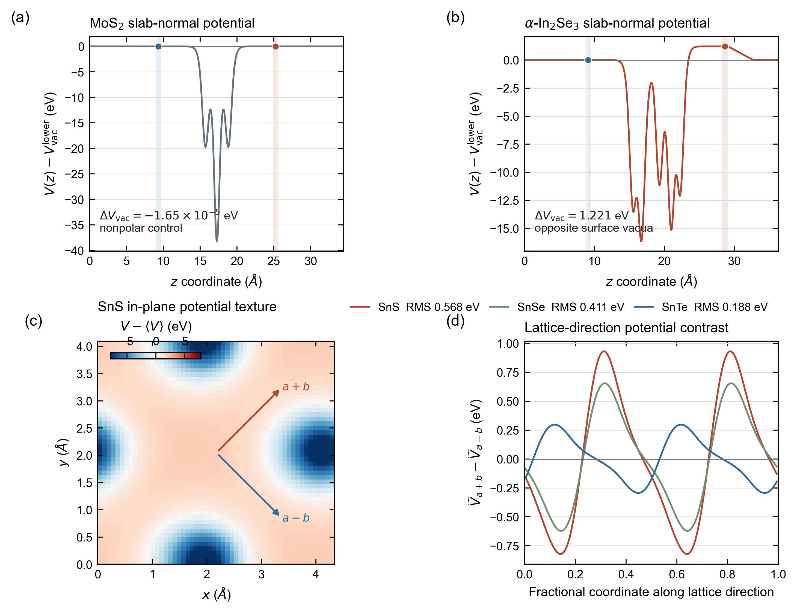

<p align="center">
  
</p>

<h1 align="center">ZStar</h1>

<p align="center">
  Reproducible polarization, Born effective charge, phonon, infrared, Raman, and dielectric-response workflows.
</p>

<p align="center">
  <a href="https://pypi.org/project/zstar/"></a>
  <a href="https://pypi.org/project/zstar/"></a>
  <a href="LICENSE"></a>
</p>

<p align="center">
  English | <a href="README.zh-CN.md">简体中文</a> |
  <a href="docs/README.en.pdf">English PDF</a> |
  <a href="docs/README.zh-CN.pdf">中文 PDF</a>
</p>

---

## Overview

ZStar is a Python workflow toolkit that connects ABACUS/PyATB, VASP, CP2K,
Quantum ESPRESSO, and Phonopy calculations to physically auditable polarization
and dielectric-response results. Its main task is to turn atomic response data
into symmetry-consistent Born effective charge (BEC) tensors, then use those
tensors for phonon, infrared (IR), dielectric, Raman, and molecular-dynamics
(MD) analysis.

The toolkit keeps every stage visible: structures, solver inputs, band-gap gates, polarization values, charge-density data, tensor reconstruction reports, spectra, and progress records remain available for inspection and restart.

The numerical checks used for the current release are summarized in [docs/validation.md](docs/validation.md).

### Main capabilities

- Forward and central finite-difference BEC calculations.
- Symmetry reduction, full-cell tensor reconstruction, and acoustic-sum-rule correction.
- A serial, resumable `0.no-move -> displaced structures` execution model.
- Reuse of the converged `0.no-move` charge density for every displacement.
- One-time insulating-state validation after the reference SCF.
- Shell, Slurm, and Torque driver generation.
- Automatic compatibility with legacy and direct-static-response PyATB versions.
- A serial, resumable CP2K backend for Berry-phase BEC tensors and native APT checks.
- Three-dimensional and hybrid two-dimensional polarization/BEC analysis.
- Phonon generation, post-processing, mode classification, IR spectra, Raman spectra, and dielectric response.
- MD dipole-fluctuation dielectric analysis using fixed or frame-dependent BEC tensors.
- Auxiliary electrostatic-potential analysis for slabs and polar materials.
- A packaged, standards-compliant Agent Skill with JSON workspace preflight.
- A versioned calculator-neutral response schema and backend plugin registry.
- Native Quantum ESPRESSO DFPT collection for molecular and bulk BEC/IR data.

The calculator-independent interface, physical `dim=0/1/2/3` contract, QE
workflow, density adapters, Phonopy interchange, polarized Raman, optical
constants, and external MD BEC providers are documented in the
[calculator-independent guide](docs/calculator_independent_backends.md).

## Physical Scope

### Three-dimensional crystals

For a periodic 3D crystal, ZStar evaluates

```text
Z*(kappa, alpha, beta) = Omega/e * dP_alpha / du_(kappa,beta)
```

from Berry-phase polarization differences. Polarization branches are matched modulo the polarization quantum before the finite difference is taken.

### Two-dimensional slabs

A slab requires separate treatment of in-plane and out-of-plane response:

- **In-plane rows:** Berry-phase polarization is used while the full supercell remains insulating.
- **Out-of-plane row:** the total slab dipole is integrated from the ABACUS charge-density cube, including ionic and electronic contributions.
- **Normalization:** in-plane BECs are made independent of vacuum height through the usual volume factor; 2D dielectric spectra are reported as sheet polarizability unless an effective thickness is supplied.

Accordingly, a complete 2D BEC calculation needs `x`, `y`, and `z` displacements. The default `zstar gen --dim 2` workflow generates all three. The current hybrid implementation requires the slab normal to align with Cartesian `z`; a tilted slab is rejected explicitly.

One reference/displaced cube pair can be audited independently:

```bash
zstar polar2d --reference-cube reference.cube \
  --displaced-cube atom_zplus.cube \
  --displacement 0.01 --outdir slab_dipole_check
```

This writes the planar charge redistribution, dipole finite difference,
effective charge, diagnostics, and PNG/PDF/SVG plots.

## Installation

ZStar requires Python 3.9 or newer.

Install the released package:

```bash
pip install -U zstar
```

Or install a local checkout:

```bash
git clone https://github.com/xdzhu/zstar.git
cd zstar
pip install .
```

External programs are required only for the corresponding workflows:

- ABACUS for SCF, charge density, force, and sparse-matrix calculations.
- PyATB for Berry-phase polarization, band checks, and electronic dielectric response.
- Phonopy for displacement generation and phonon post-processing.
- CP2K for the optional CP2K finite-displacement BEC backend.
- VASP for native bulk BEC and mode-displaced dielectric-response workflows.
- Quantum ESPRESSO for the optional native DFPT BEC, dielectric, and IR route.

Verify the command:

```bash
zstar --version
zstar --help
```

## Agent Skill

Install the bundled, standards-compliant `$run-zstar-workflows` skill after
installing ZStar:

```bash
zstar agent-skill install
zstar agent-skill preflight --root . --lane bec --dim bulk
```

Open a new agent session after installation. Use `--force` to refresh the skill
after upgrading ZStar, or `--dest /path/to/skills` for a custom compatible skill
directory. The skill encodes dimensional conventions, reference-first execution,
restart behavior, scheduler authorization boundaries, and artifact-based
completion checks. See [docs/agent_skill.md](docs/agent_skill.md).

## Born Charge Workflow

### 1. Generate the reference and displacement folders

Run this in a directory containing `STRU`:

```bash
zstar gen --stru STRU --pyatb --method forward --force
```

For a 2D slab:

```bash
zstar gen --stru STRU --dim 2 --pyatb --method forward --force
```

The generated tree starts with `0.no-move`, followed by atom/direction folders such as `1.Ti/x+`. No per-displacement scheduler script is required.

Useful generation options:

| Option | Meaning |
| --- | --- |
| `--method forward|central` | One-sided or central finite difference. |
| `--reduce` / `--all` | Symmetry-reduced atoms (default) or every atom. |
| `--move "x y z"` | Explicit displacement directions. |
| `--dim 2|3` | Two-dimensional or three-dimensional analysis. |
| `--input-mode abacus|pyatb|hamgnn|custom` | Input preparation route. |
| `--input_sets FILES` | Extra files or directories copied into generated tasks. |

### 2. Run the serial, resumable calculation

Local shell execution:

```bash
zstar workflow run --root . --dim 3 \
  --abacus-command "mpirun -np 1 abacus" \
  --pyatb-command "mpirun -np 1 pyatb" \
  --omp-threads 28
```

For a slab, use `--dim 2`.

The default execution order is:

1. Run `0.no-move` SCF and save charge density and sparse matrices.
2. Generate a normal PyATB high-symmetry band path with `pyatb_input --band`.
3. Stop before any displacement if the reference is metallic.
4. Calculate reference polarization and electronic dielectric response.
5. Copy the reference charge cube/restart into each target `OUT.<suffix>/`.
6. Run every displacement serially and calculate its polarization.
7. Record stage state under `.zstar/` so an interrupted run can resume.

The regular band path is the default lightweight gate. It can detect a gap closure on the sampled path but cannot exclude an off-path metallic pocket. A denser MP-grid check is explicit:

```bash
zstar workflow run --gap-mode mp --mp-density 0.08
```

Inspect progress at any time:

```bash
zstar workflow status
```

### 3. Generate scheduler-specific drivers

Shell:

```bash
zstar workflow script --backend shell --dim 3
```

Slurm:

```bash
zstar workflow script --backend slurm --dim 3 \
  --queue compute --cpus-per-task 28 --walltime 24:00:00
```

Torque/PBS:

```bash
zstar workflow script --backend torque --dim 3 \
  --queue batch --cpus-per-task 28 --walltime 24:00:00
```

Backend-aware defaults use `mpirun -np N` for shell/Torque and
`srun --ntasks=N` for Slurm. Add `--dry-run` to validate the generated script,
environment, ordering, and resume records without launching a calculation.
The three backends and their scheduler acceptance checks are recorded in
[docs/validation.md](docs/validation.md#scheduler-backend-smoke-checks).

Add `--submit` only when the generated script has been reviewed and the active environment provides the required executables.

### 4. Collect polarization and construct BEC tensors

Three-dimensional:

```bash
zstar deal --dim 3 --method forward --pyatb
```

Two-dimensional hybrid treatment:

```bash
zstar deal --dim 2 --method forward --pyatb
```

For central differences, use `--method central` consistently in both `gen` and `deal`.

Key outputs:

| File | Meaning |
| --- | --- |
| `Z-BORN-reduced.out` | Raw tensors for explicitly calculated symmetry representatives. |
| `Z-BORN-symm.out` | Full-cell tensors reconstructed by symmetry and corrected by the acoustic sum rule. |
| `Z-BORN-reduced-neutral.out` | Reduced tensors after reconstruction and neutrality correction. |
| `BORN` | Electronic dielectric tensor plus Phonopy-order BEC tensors. |
| `BORN-for-phonopy.out` | Explicitly named copy of the Phonopy-compatible data. |
| `born_symmetry_report.json` | Machine-readable reconstruction and residual report. |
| `zstar_2d_bec.json` | Per-atom diagnostics for hybrid 2D BEC calculations. |

## CP2K BEC Backend

For a three-dimensional, insulating Gamma-point CP2K input, ZStar can build BEC
tensors directly from periodic Berry-phase dipoles:

```bash
zstar cp2k-bec prepare --input input.inp --root cp2k_bec \
  --method central --displacement 0.005
zstar cp2k-bec run --root cp2k_bec --cp2k-command cp2k.ssmp \
  --omp-threads 20 --data-dir /path/to/cp2k/data
zstar cp2k-bec collect --root cp2k_bec
```

The reference wavefunction is reused by every displacement, and interrupted
runs resume from `.zstar/cp2k_bec_state.json`. CP2K 2025.2+ native `APT_FD`
results can be generated and compared through `cp2k-bec native` and
`cp2k-bec compare`. See the [complete CP2K guide](docs/cp2k_bec.md) for tensor
conventions, input restrictions, convergence checks, and direct-node validation.

## VASP BEC Backend

ZStar can also drive VASP's native BEC implementations. Use `dfpt` for
`LEPSILON` linear response or `finite-field` for `LCALCEPS`/PEAD:

```bash
zstar vasp-bec prepare --input-dir vasp_input --root vasp_bec --method dfpt
zstar vasp-bec run --root vasp_bec --vasp-command "mpirun -np 20 vasp_std"
zstar vasp-bec collect --root vasp_bec
```

The reference SCF is checked for a finite band gap before the response stage,
and completed stages are resumable. The collector writes normalized JSON,
ZStar tensors, and a Phonopy-compatible `BORN` file. The
[complete VASP guide](docs/vasp_bec.md) documents finite-field safeguards,
cluster scripts, tensor conventions, and the VASP 6.3.2 SiC validation.

## Phonons and Dielectric Response

### 1. Generate phonon calculations

In a phonon working directory containing `STRU`, `KPT`, and an `INPUT` with `cal_force 1`:

```bash
zstar ph --stru STRU --dim "2 2 2" --symmprec 1e-3
```

Run every generated `disp-*` force calculation with the local execution system. `zstar ph` does not require or duplicate an `abacus_x.sh`; if one is present it is copied only as an optional convenience.

### 2. Post-process forces and classify Gamma modes

```bash
zstar postph
zstar irrep --file irreps.yaml --mode db
```

For non-analytical corrections, copy the BEC workflow's `BORN` into the phonon directory before post-processing:

```bash
cp ../polar/BORN .
zstar postph --nac
```

### 3. Static and frequency-dependent dielectric response

Copy the full tensors as well:

```bash
cp ../polar/BORN .
cp ../polar/Z-BORN-symm.out .
```

Static response:

```bash
zstar calc --qpoints qpoints.yaml --born Z-BORN-symm.out \
  --dielectric BORN --dim 3
```

Frequency-dependent response:

```bash
zstar freq --qpoints qpoints.yaml --born Z-BORN-symm.out \
  --dielectric BORN --dim 3 --plot
```

Modes below 5 cm-1 are excluded by default; change this with `--acoustic-cutoff`.

For 2D, omit `--thickness` to obtain a vacuum-independent sheet polarizability in angstroms:

```bash
zstar calc --qpoints qpoints.yaml --born Z-BORN-symm.out \
  --dielectric BORN --dim 2
```

Provide `--thickness ANGSTROM` only when an effective 3D dielectric tensor is desired.

## Infrared Spectrum

Calculate mode effective charges, oscillator strengths, broadened IR intensity, and dielectric/sheet response:

```bash
zstar ir --qpoints qpoints.yaml \
  --born Z-BORN-symm.out --dielectric BORN \
  --dim 3 --broadening 10 --outdir ir_spectrum
```

Select modes explicitly when needed:

```bash
zstar ir --modes "4,5,8-10" --outdir ir_selected
```

Typical outputs are `ir_modes.csv`, `ir_spectrum.dat`, `ir_response_real.dat`, `ir_response_imag.dat`, `ir_spectrum.png`, `ir_spectrum.pdf`, `ir_spectrum.svg`, and `ir_summary.json`.

## Raman Spectrum

ZStar obtains non-resonant Raman tensors by central finite differences of the electronic dielectric response along Gamma-point normal coordinates.

### 1. Prepare mode displacements

```bash
zstar raman prepare --stru STRU --qpoints qpoints.yaml \
  --modes "4-12" --amplitude 0.02 --outdir raman \
  --copy INPUT-scf --copy KPT
```

The amplitude is a normal-coordinate displacement in `angstrom * sqrt(amu)`.

### 2. Run, collect, and plot

```bash
zstar raman run --raman-dir raman \
  --reference 0.no-move --qpoints qpoints.yaml \
  --dim 3 \
  --abacus-command "mpirun -np 1 abacus" \
  --pyatb-command "mpirun -np 1 pyatb" \
  --omp-threads 28
```

The reference insulating gate is reused once; it is not repeated for every mode displacement. Each `plus`/`minus` stage reuses the reference charge density and records resumable state.

Separate operations are also available:

```bash
zstar raman status --raman-dir raman
zstar raman collect --raman-dir raman --qpoints qpoints.yaml --dim 3
zstar raman spectrum --raman-dir raman --qpoints qpoints.yaml --dim 3
```

For 2D, `--dim 2` converts the vacuum-dependent dielectric derivative to a sheet-susceptibility derivative using the cell height stored in the phonon data.

## Molecular IR and Raman

For the complete physical convention, workflow, outputs, and benchmark, see
[Molecular IR and Raman spectroscopy](docs/molecular_spectroscopy.md).

An isolated molecule is represented in a sufficiently large periodic cell.
Prepare its positive-frequency vibrational modes with the same central
normal-coordinate displacements used for Raman calculations:

```bash
zstar raman prepare --stru STRU --qpoints qpoints.yaml \
  --acoustic-cutoff 100 --amplitude 0.02 --outdir raman \
  --copy INPUT-scf --copy KPT
```

The complete resumable calculation produces both spectra:

```bash
zstar raman run --raman-dir raman --reference 0.no-move \
  --qpoints qpoints.yaml --dim 0 \
  --abacus-command "mpirun -np 1 abacus" \
  --pyatb-command "mpirun -np 1 pyatb" \
  --spectrum-outdir raman_spectrum --ir-outdir ir_spectrum
```

Each displaced SCF is evaluated with two lightweight PYATB stages. The static
dielectric response is converted to a molecular polarizability derivative,
`dalpha/dQ = V/(4*pi) * d(epsilon_r)/dQ`. Branch-wrapped Berry polarization is
converted to a molecular dipole derivative, `dmu/dQ = V * dP/dQ`. The
normal-coordinate step `Q` is in `angstrom * sqrt(amu)`.

Existing polarization results can be post-processed independently:

```bash
zstar ir --dim 0 --qpoints qpoints.yaml \
  --displacements raman --outdir ir_spectrum
zstar raman spectrum --dim 0 --qpoints qpoints.yaml \
  --raman-dir raman --outdir raman_spectrum
```

Molecular spectra are normalized for mode assignment and workflow validation.
They are not reported as gas-phase integrated cross sections. Use a converged
vacuum size, basis, displacement amplitude, and electronic-response grid for
quantitative intensity work.

### VASP and CP2K calculators

The calculator-neutral spectroscopy layer also supports VASP and CP2K:

```bash
zstar spectra prepare --calculator vasp --input-dir vasp_input \
  --modes-xml phonon/vasprun.xml --root vasp_spectra --dim 3
zstar spectra run --root vasp_spectra --command "mpirun -np 20 vasp_std"
zstar spectra collect --root vasp_spectra

zstar spectra prepare --calculator cp2k --input h2o.inp \
  --root cp2k_spectra --dim 0
```

VASP uses central differences of native dielectric responses; CP2K uses native
vibrational dipole and `LINRES/POLAR` intensities. See the
[calculator spectroscopy guide](docs/calculator_spectroscopy.md).

## Representative Validation Figures

The compact source data, plotting script, vector files, and integrity manifest
are archived in [docs/paper_figures](docs/paper_figures/README.md).

<p align="center">
  
</p>

The BTO validation includes all ten positive-frequency optical modes and 20
completed Raman finite-difference response tasks. The `B1` mode at
293.38 cm-1 is Raman active and IR silent.

<p align="center">
  
</p>

The In2Se3 validation displays the Berry-phase/cube-integral split and the
actual planar charge redistribution for an out-of-plane In displacement.

## MD + BEC Dielectric Response

`zstar md` does not prescribe how frame-dependent BECs are generated. They may come from:

- ZStar finite differences on selected snapshots.
- One fixed tensor set applied to every frame.
- An external charge/BEC model such as QNEP or another user workflow.

ZStar matches those tensors to the trajectory, reconstructs periodic displacements, builds the ionic dipole series, and evaluates its fluctuation susceptibility.

Fixed BEC tensors:

```bash
zstar md --dump dump.lammpstrj \
  --fixed-bec Z-BORN-symm.out \
  --electronic-dielectric BORN \
  --temperature 300 --type-map "1:Hf,2:Zr,3:O" \
  --outdir md_fixed
```

Frame-dependent tensors:

```bash
zstar md --dump dump.lammpstrj \
  --bec-dir bec_frames --bec-pattern "frame_{step}.npy" \
  --electronic-dielectric BORN \
  --temperature 300 --type-map "1:Hf,2:Zr,3:O" \
  --start-step 200000 --stride-step 100 \
  --outdir md_dynamic
```

The total static tensor is

```text
epsilon_total = epsilon_infinity + chi_ionic
```

Outputs separate `chi_ionic.dat`, `epsilon_ionic.dat`, `epsilon_electronic.dat`, and `epsilon_total.dat`. If `--electronic-dielectric` is omitted, the identity tensor is used and the output is explicitly identified as `I + chi_ionic`.

## PyATB Compatibility

ZStar probes the PyATB executable selected for the workflow:

- New builds with direct static response use `static_dielectric_only`.
- Older builds use a compact 0-30 eV optical grid at 0.1 eV spacing. This range was checked against the new direct-static intercept; the coarse spacing avoids an unnecessarily dense full optical spectrum.
- Both `static_dielectric_function.dat` and legacy `dielectric_function_real_part.dat` are accepted.

The selected mode and detected version are saved in `zstar_pyatb_compat.json`.

## Electrostatic Potential

`zstar potential` (alias `zstar pot`) analyzes ABACUS `ElecStaticPot.cube` files:

```bash
zstar pot --cube OUT.ABACUS/ElecStaticPot.cube \
  --axes z --plane xy --plane-average --tile 5 5 \
  --vacuum-level --vacuum-sides --vacuum-window 0.75 \
  --polar-arrow auto \
  --outdir potential
```

It can generate axis profiles, tiled planar maps, directional averages, and one- or two-sided vacuum-level diagnostics. Local side windows avoid mixing a dipole-correction reset into a polar-slab surface plateau. In the representative tests, MoS2 has `Delta V_vac = -1.65e-5 eV`, while alpha-In2Se3 has `Delta V_vac = 1.220812 eV`.



Commands, interpretation limits, and the SnS/SnSe/SnTe directional examples are collected in [docs/potential_examples.md](docs/potential_examples.md).

## Command Map

| Command | Purpose |
| --- | --- |
| `zstar gen` | Generate reference and BEC displacement folders. |
| `zstar workflow run/status/script` | Run, inspect, or script the serial resumable workflow. |
| `zstar deal` / `born` / `polar` | Collect polarization and construct BEC tensors. |
| `zstar polar2d` | Audit a slab cube-pair dipole difference and out-of-plane BEC. |
| `zstar bornsym` / `symcheck` | Reconstruct or verify tensors by symmetry. |
| `zstar ph` / `postph` | Generate and post-process phonon tasks. |
| `zstar irrep` | Classify Gamma-point optical activity. |
| `zstar calc` / `freq` | Calculate static or frequency-dependent dielectric response. |
| `zstar ir` | Calculate mode charges and IR spectra. |
| `zstar raman` | Prepare, run, collect, and plot Raman finite differences. |
| `zstar spectra` | Run unified VASP or CP2K IR/Raman workflows. |
| `zstar md` | Combine an MD trajectory with fixed or frame-dependent BECs. |
| `zstar cp2k-bec` | Prepare, run, resume, collect, and validate CP2K BEC calculations. |
| `zstar db init/collect` | Create manifests and collect an auditable BEC/High-K database. |
| `zstar potential` / `pot` | Analyze electrostatic-potential cube files. |
| `zstar wyckoff` / `vasp` | Inspect Wyckoff positions or convert `STRU`. |
| `zstar agent-skill` | Install the Agent Skill or emit a JSON workspace preflight. |

## Repository and Release Policy

- `examples/` contains local validation data and is intentionally ignored.
- `dist/` and `build/` are local build products and are not committed.
- `job_scripts/` contains reusable scheduler templates and is version controlled.
- [docs/how_to_update_pypi.md](docs/how_to_update_pypi.md) records the release procedure.

The relative logo works for authenticated viewers of a private GitHub repository. PyPI requires a public HTTPS image URL, so `README_PYPI.md` deliberately omits private images.

## Citation and License

If ZStar supports published work, please cite the ZStar software article or repository release together with the underlying electronic-structure and lattice-dynamics programs used in the calculation.

Machine-readable citation metadata for this release are provided in [CITATION.cff](CITATION.cff).

ZStar is distributed under the GNU General Public License v3.0.

Copyright (c) Xudong Zhu.
