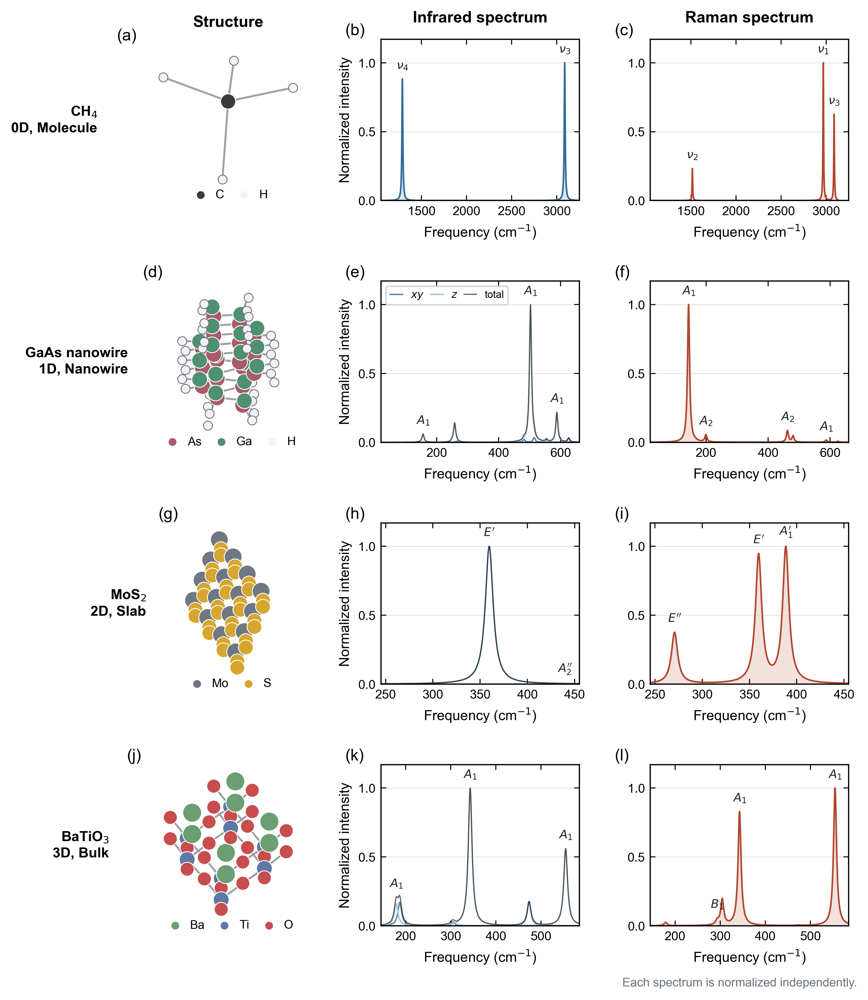

<p align="center">
  
</p>

<h1 align="center">ZStar</h1>

<p align="center">
  面向极化、Born 有效电荷、声子、红外、拉曼与介电响应的可复现工作流工具。
</p>

<p align="center">
  <a href="https://pypi.org/project/zstar/"></a>
  <a href="https://pypi.org/project/zstar/"></a>
  <a href="LICENSE"></a>
</p>

<p align="center">
  <a href="README.md">English</a> | 简体中文 |
  <a href="docs/README.en.pdf">English PDF</a> |
  <a href="docs/README.zh-CN.pdf">中文 PDF</a>
</p>

---

## 项目简介

ZStar 是连接 ABACUS + PYATB、VASP、CP2K、Quantum ESPRESSO 与 Phonopy
的 Python 响应性质工作流工具。其核心任务是把不同计算器的原子响应数据整理为
满足晶体对称性与声学求和规则的 Born 有效电荷（BEC）张量，并进一步完成声子、
红外（IR）、介电与拉曼分析。

ZStar 不会隐藏中间步骤。结构、输入文件、绝缘性门控、极化值、电荷密度、张量重构报告、光谱和任务状态都会保留下来，便于检查、复现与断点续算。

当前版本的数值验证与运行环境汇总见 [docs/validation.zh-CN.md](docs/validation.zh-CN.md)。

### 主要功能

- 前向差分与中心差分 BEC。
- 对称性约化、全原子张量重构和声学求和规则修正。
- `0.no-move -> 位移结构` 的单任务串行、可恢复工作流。
- 所有位移任务复用 `0.no-move` 的收敛电荷密度。
- 参考 SCF 完成后只执行一次绝缘性检查。
- 生成 shell、Slurm 和 Torque/PBS 驱动脚本。
- 自动兼容旧版 PyATB 与支持静态直算的新版本 PyATB。
- CP2K Berry 相位 BEC 的串行断点续算后端及原生 APT 对照。
- 三维、二维混合以及一维混合极化/BEC 处理。
- 声子生成、后处理、模式分类、红外谱、拉曼谱和介电响应。
- 面向薄膜和极性材料的静电势辅助分析。
- 随软件打包的规范化 Agent Skill 和 JSON 工作区预检查。
- 版本化的计算器无关响应规范和后端插件注册机制。
- 面向分子和三维 bulk 的 Quantum ESPRESSO 原生 DFPT BEC/IR 收集流程。

计算器无关接口、`dim=0/1/2/3` 物理约定、QE 工作流、电荷密度适配器、
Phonopy 数据交换、偏振 Raman、光学常数及不同维度响应归一化详见
[计算器无关中文手册](docs/calculator_independent_backends.zh-CN.md)。

## 物理处理范围

### 三维周期晶体

对于三维周期晶体，ZStar 根据

```text
Z*(kappa, alpha, beta) = Omega/e * dP_alpha / du_(kappa,beta)
```

计算 BEC。有限差分之前会按照极化量子对 Berry 相位极化分支进行匹配，避免直接相减导致的分支跳变。

### 一维链与纳米线

对于沿 `z` 周期的纳米线，ZStar 将周期 `z` 方向的 PYATB Berry 极化与非周期
`x/y` 方向的 ABACUS 电荷 cube 实空间偶极结合，输出与真空无关的 BEC 和单位为
`Angstrom^2` 的线极化率，并支持 Gamma 点 IR/Raman。程序会拒绝错误的 bulk NAC，
因为有限波矢极性声子需要真正的 1D Coulomb cutoff。详见
[一维工作流中文手册](docs/one_dimensional_workflow.zh-CN.md)。

### 二维材料

二维薄膜的面内与面外响应采用不同处理：

- **面内极化列：**在体系保持绝缘的前提下，沿用 Berry 相位极化差分。
- **面外极化列：**从 ABACUS 电荷密度 cube 文件做实空间积分，同时包含离子和电子偶极。
- **归一化：**面内 BEC 通过超胞体积因子消除真空层高度依赖；二维介电谱默认输出与真空无关的片层极化率。

ZStar 的统一张量约定为：行表示原子位移/力，列表示极化/电场。因此，完整二维
BEC 需要 `x`、`y`、`z` 三个方向的位移。`zstar bec pre --dim 2` 默认会生成全部三个
方向。当前混合算法要求薄膜法向与笛卡尔 `z` 轴对齐；对于倾斜薄膜会明确报错退出。

可以独立审计一对参考/位移电荷密度 cube：

```bash
zstar polar2d --reference-cube reference.cube \
  --displaced-cube atom_zplus.cube \
  --displacement 0.01 --outdir slab_dipole_check
```

程序会输出平面电荷重排、偶极有限差分、有效电荷、诊断信息，以及
PNG/PDF/SVG 图片。

## 安装

ZStar 要求 Python 3.9 或更高版本。

从 PyPI 安装：

```bash
pip install -U zstar
```

从本地仓库安装：

```bash
git clone https://github.com/xdzhu/zstar.git
cd zstar
pip install .
```

外部程序只在对应功能中需要：

- ABACUS：SCF、电荷密度、力与稀疏矩阵。
- PyATB：Berry 相位极化、能带检查和电子介电响应。
- Phonopy：位移结构生成与声子后处理。
- CP2K：可选的 CP2K 有限位移 BEC 后端。
- VASP：原生三维 BEC 和模式位移介电响应工作流。
- Quantum ESPRESSO：可选的原生 DFPT BEC、介电和 IR 路线。

核心安装使用 `spglib` 完成周期对称性处理，不再强制依赖 `pymatgen`。
如果使用 `vasprun.xml`、`CHGCAR/POTCAR` 转换，或旧版 smodes/Wyckoff 适配器，
请安装可选的 VASP 扩展：

```bash
pip install -U "zstar[vasp]"
```

POSCAR/CONTCAR、ABACUS `STRU`、MD 结构帧读取以及核心对称性约化均由 ZStar
自带的轻量读取器完成。

检查安装：

```bash
zstar --version
zstar --help
```

计算软件路径只需在项目内配置一次（加 `--user` 可写入用户配置），随后任务脚本
会按 shell/Torque 或 Slurm 自动选择 `mpirun` 或 `srun`：

```bash
zstar config init
zstar config set executables.abacus /opt/abacus/bin/abacus
zstar config set executables.pyatb /opt/pyatb/bin/pyatb
zstar config check
zstar backend list --check
```

## Agent Skill

安装 ZStar 后，可直接安装随软件提供的 `$run-zstar-workflows` 技能：

```bash
zstar skill install
zstar skill preflight --root . --lane bec --dim bulk
```

安装后新建智能体会话。升级 ZStar 后使用 `--force` 刷新技能；其他兼容框架可用
`--dest /path/to/skills` 指定技能父目录。该 Skill 固化了维度约定、参考态优先执行、
断点续算、调度系统权限边界和基于产物的完成判据。详见
[docs/agent_skill.zh-CN.md](docs/agent_skill.zh-CN.md)。

规范 CLI、兼容别名、配置优先级和全部公共工具族见
[命令行参考](docs/cli_reference.zh-CN.md)。

## Born 有效电荷工作流

### 1. 生成参考与位移目录

在包含 `STRU` 的目录中执行：

```bash
zstar bec pre --stru STRU
```

`bec pre` 默认使用 ABACUS + PYATB 路线以及 forward 前向有限差分，因此不必
重复写这些参数。只有切换到其他后端时，才使用 `--calculator cp2k`、
`--calculator vasp` 或 `--calculator qe`。

二维薄膜：

```bash
zstar bec pre --stru STRU --dim 2
```

沿 `z` 周期的一维纳米线：

```bash
zstar bec pre --stru STRU --dim 1 --method central
```

生成的目录从 `0.no-move` 开始，后面是类似 `1.Ti/x+` 的原子/方向位移目录。每个位移目录不再需要单独复制一份任务脚本。

常用选项：

| 选项 | 含义 |
| --- | --- |
| `--method forward\|central` | 前向或中心有限差分。 |
| `--reduce` / `--all` | 默认只算对称性代表原子，或强制计算全部原子。 |
| `--move "x y z"` | 显式指定原子位移方向。 |
| `--displacement 0.01` | 有限位移的半步长，单位为 Angstrom。 |
| `--dim 0\|1\|2\|3` | 分子、一维、二维或三维处理。 |
| `--input-mode abacus\|pyatb\|hamgnn\|custom` | 输入文件准备方式。 |
| `--input_sets FILES` | 复制到任务目录的附加文件或文件夹。 |
| `--pp DIR` | ABACUS 赝势（`.upf`）目录。 |
| `--orb DIR` | ABACUS 数值轨道（`.orb`）目录。 |

```bash
zstar bec pre --stru STRU \
  --pp /path/to/PSEUDO \
  --orb /path/to/ORBITAL
```

如果赝势和数值轨道不与案例放在一起，可以在生成任务前指定资源目录。ZStar
会先按照 `STRU` 中的精确文件名查找；如果找不到，只有在元素前缀匹配结果唯一
时才会自动选取文件。多个候选文件会使命令停止，并列出候选项以及如何填写精确
文件名或指定更窄的目录。ZStar 不会修改原始 `STRU`，解析后的副本写入
`.zstar/STRU.resolved`，资源来源和 SHA256 校验值写入 `.zstar/assets.json`。

常用目录可以配置为全局默认值：

```bash
zstar config init --user
zstar config set abacus.pseudo_dir /opt/abacus/PSEUDO --user
zstar config set abacus.orbital_dir /opt/abacus/ORBITAL --user
zstar config check
```

单次命令中的 `--pp` 和 `--orb` 优先于全局配置。原始 `STRU` 中的相对路径
始终相对于 `STRU` 所在目录解析，而不是相对于偶然的 shell 当前目录。

### 2. 串行执行并支持断点续算

本地 shell 运行：

```bash
zstar bec run --root . \
  --abacus-command "mpirun -np 1 abacus" \
  --pyatb-command "mpirun -np 1 pyatb" \
  --omp-threads 28
```

一维纳米线和二维材料分别使用 `--dim 1` 与 `--dim 2`。
孤立分子使用 `--dim 0`；程序采用 Gamma 点真空超胞并输出原子极化张量
（APT），不把它误称为周期晶体的 BEC。
低维极化/BEC 任务会自动写入 `out_chg 1 10`，避免 ABACUS cube 默认舍入精度限制
横向偶极差分。

默认执行顺序如下：

1. 执行 `0.no-move` SCF，输出电荷密度与稀疏矩阵。
2. 使用 `pyatb_input --band` 生成常规高对称能带路径。
3. 如果参考结构为金属，在任何位移计算开始前报错退出。
4. 计算参考结构的极化和电子介电张量。
5. 将参考电荷 cube/restart 文件复制到每个位移任务的 `OUT.<suffix>/`。
6. 按确定顺序串行执行全部位移及其极化计算。
7. 在 `.zstar/` 保存阶段状态；中断后再次执行同一命令即可继续。

默认采用普通能带路径进行轻量绝缘性门控。它可以发现所采样路径上的闭隙，但不能排除路径之外的小型费米面。只有显式指定时才采用更严格的 MP 网格：

```bash
zstar bec run --root . --gap-mode mp --mp-density 0.08
```

查看进度：

```bash
zstar bec stat --root .
```

### 3. 生成不同运行环境的脚本

本地 shell：

```bash
zstar bec job --root . --system shell
```

Slurm：

```bash
zstar bec job --root . --system slurm \
  --queue compute --tasks 28 --cpus-per-task 1 --walltime 24:00:00
```

Torque/PBS：

```bash
zstar bec job --root . --system torque \
  --queue batch --tasks 28 --cpus-per-task 1 --walltime 24:00:00
```

队列、节点数、CPU 分配、墙钟时间、项目账号和集群模块都属于具体任务，应在生成
作业脚本时指定，不要写入计算软件配置。`module load` 和 `conda activate` 等环境
初始化放入 `--env-script` 指定的脚本：

```bash
zstar bec job --root . --system slurm \
  --nodes 1 --tasks 28 --cpus-per-task 1 \
  --queue compute --account PROJECT --walltime 24:00:00 \
  --env-script ./env.sh
```

生成的驱动脚本会使用 Slurm 的 `srun`，或 shell/Torque 的 `mpirun`。`zstar phonon
job` 和 `zstar spectra job` 使用相同方式；提交前可以用 `--dry-run` 检查脚本。

后端默认启动命令会自动适配：shell/Torque 使用 `mpirun -np N`，Slurm
使用 `srun --ntasks=N`。加入 `--dry-run` 可以在不启动计算的情况下检查
脚本、环境、执行顺序和断点状态。三类后端及调度器接收验证见
[docs/validation.zh-CN.md](docs/validation.zh-CN.md#调度后端冒烟检查)。

只有在检查脚本内容并确认运行环境正确后，再使用 `--submit`。

### 4. 后处理极化并构造 BEC

ABACUS + PYATB 分子 APT：

```bash
zstar bec pre --stru STRU --dim 0 --method central --displacement 0.01
zstar bec run --root . \
  --abacus-command abacus --pyatb-command pyatb --omp-threads 20
zstar bec post --root .
```

分子收集器会展开对称等价原子、施加平移不变性约束，并写出
`molecular_apt.json` 和统一格式的 `zstar_response.json`。当 PYATB 最终极化行
因六位小数舍入而不足以解析分子微小响应时，解析器会从分别输出的离子相位和
电子相位重构更高精度的极化。

三维：

```bash
zstar bec post --root .
```

二维混合处理：

```bash
zstar bec post --root .
```

沿 `z` 周期的一维混合处理：

```bash
zstar bec post --root .
```

工作流清单会把 `pre` 选择的维度与差分方法传递给后续动作。旧的
`gen/workflow/deal` 命令继续作为兼容入口保留。

关键输出：

| 文件 | 含义 |
| --- | --- |
| `Z-BORN-reduced.out` | 显式计算的对称性代表原子的原始张量。 |
| `Z-BORN-symm.out` | 经对称性展开并满足声学求和规则的全原子张量。 |
| `Z-BORN-reduced-neutral.out` | 对称展开与电中性修正后的约化张量。 |
| `BORN` | 电子介电张量和 Phonopy 原子顺序的 BEC。 |
| `BORN-for-phonopy.out` | 与 `BORN` 内容一致、名称更明确的输出。 |
| `born_symmetry_report.json` | 对称重构与残差报告。 |
| `zstar_2d_bec.json` | 二维混合 BEC 的逐原子积分诊断。 |
| `zstar_1d_bec.json` | 一维混合 BEC 的逐原子积分诊断。 |
| `molecular_apt.json` | 分子 APT、对称展开和平移求和诊断。 |

## CP2K BEC 后端

对于分子（`--dim 0`）或三维绝缘 Gamma 点 CP2K 输入，ZStar 可以从偶极直接
构造 APT 或 BEC 张量：

```bash
zstar bec pre --calculator cp2k --input input.inp --root cp2k_bec --dim 0 \
  --method central --displacement 0.005
zstar bec run --root cp2k_bec --cp2k-command cp2k.ssmp \
  --omp-threads 20 --data-dir /path/to/cp2k/data
zstar bec post --root cp2k_bec
```

参考波函数会被所有位移任务复用，中断后从 `.zstar/cp2k_bec_state.json` 恢复。
对于 CP2K 2025.2 及以上版本，还可以用 `cp2k-bec native` 和
`cp2k-bec compare` 生成并比较原生 `APT_FD` 张量。张量约定、输入限制、收敛检查
和直连计算节点验证见[完整中文文档](docs/cp2k_bec.zh-CN.md)。

## VASP BEC 后端

ZStar 也可直接驱动 VASP 的原生 BEC 功能：`dfpt` 对应 `LEPSILON` 线性响应，
`finite-field` 对应 `LCALCEPS`/PEAD 有限场：

```bash
zstar bec pre --calculator vasp --input-dir vasp_input --root vasp_bec --method dfpt
zstar bec run --root vasp_bec --vasp-command "mpirun -np 20 vasp_std"
zstar bec post --root vasp_bec
```

工作流会先完成参考 SCF 并检查带隙，确认绝缘后才进入响应阶段；已完成阶段可以
断点续算。收集器统一输出 JSON、ZStar 张量和 Phonopy 兼容的 `BORN` 文件。
有限场保护、集群脚本、张量约定及 VASP 6.3.2 SiC 实机验证见
[完整中文文档](docs/vasp_bec_zh.md)。

## 声子与介电响应

### 1. 生成声子位移任务

在包含 `STRU`、`KPT` 以及已设置 `cal_force 1` 的 `INPUT` 的声子目录中执行：

```bash
zstar phonon pre --root . --calculator abacus \
  --stru STRU --dim "2 2 2" --symmprec 1e-3
zstar phonon run --root .
```

随后按照本地运行环境完成全部 `disp-*` 目录中的力计算。`zstar ph` 不要求也不会强制复制 `abacus_x.sh`；若当前目录确有该脚本，则只把它作为可选便利文件复制。

### 2. 后处理力并查看 Gamma 模式分类

```bash
zstar phonon stat --root .
zstar phonon post --root .
zstar phonon irrep --root . --file irreps.yaml --mode db
```

如果需要非解析项修正，应先把 BEC 工作流中的 `BORN` 复制到声子目录：

```bash
cp ../polar/BORN .
zstar phonon post --root . --nac
```

### 3. 静态与频率相关介电响应

同时复制完整 BEC：

```bash
cp ../polar/BORN .
cp ../polar/Z-BORN-symm.out .
```

静态介电响应：

```bash
zstar dielectric static --qpoints qpoints.yaml --born Z-BORN-symm.out \
  --dielectric BORN --dim 3
```

频率相关介电响应：

```bash
zstar dielectric freq --qpoints qpoints.yaml --born Z-BORN-symm.out \
  --dielectric BORN --dim 3
```

程序默认写出零频张量、响应实部/虚部数据以及 PNG/PDF/SVG 图；只需数据时
使用 `--no-plot`。默认排除低于 5 cm-1 的声学模式；可以通过
`--acoustic-cutoff` 调整。

二维体系不指定 `--thickness` 时，输出与真空层无关、单位为埃的片层极化率：

```bash
zstar dielectric static --qpoints qpoints.yaml --born Z-BORN-symm.out \
  --dielectric BORN --dim 2
```

只有需要定义某个等效三维介电张量时，才设置 `--thickness ANGSTROM`。
完整物理约定、三维与二维算例及输出规范见
[介电响应指南](docs/dielectric_response.zh-CN.md)。

## 红外谱

计算模式有效电荷、振子强度、展宽后的红外谱和介电/片层响应：

```bash
zstar spectra pre --calculator abacus --kind ir --root ir_spectrum \
  --qpoints qpoints.yaml \
  --born Z-BORN-symm.out --dielectric BORN \
  --dim 3
zstar spectra post --root ir_spectrum
```

需要显式选择模式或精细控制绘图时，可调用保留的底层专家命令：

```bash
zstar ir --modes "4,5,8-10" --outdir ir_selected
```

典型输出包括 `ir_modes.csv`、`ir_spectrum.dat`、`ir_response_real.dat`、`ir_response_imag.dat`、`ir_spectrum.png`、`ir_spectrum.pdf`、`ir_spectrum.svg` 和 `ir_summary.json`。

## 拉曼谱

ZStar 沿 Gamma 点简正坐标对电子介电响应做中心差分，得到非共振 Raman 张量与 Placzek 强度。

### 1. 生成简正模式正负位移

```bash
zstar spectra pre --calculator abacus --kind raman --root raman \
  --stru STRU --qpoints qpoints.yaml \
  --modes "4-12" --amplitude 0.02 \
  --copy INPUT-scf --copy KPT
```

`--amplitude` 的单位为 `angstrom * sqrt(amu)`。

### 2. 串行计算、收集并绘谱

```bash
zstar spectra run --root raman --reference 0.no-move \
  --abacus-command "mpirun -np 1 abacus" \
  --pyatb-command "mpirun -np 1 pyatb" \
  --omp-threads 28
zstar spectra stat --root raman
zstar spectra post --root raman
```

参考结构的绝缘性门控只复用一次，不会对每个模式位移重复计算。所有 `plus`/`minus` 阶段都复用参考电荷密度，并记录可恢复状态。

保留的 `zstar raman collect` 与 `zstar raman spectrum` 专家命令可用于对已有
模式位移树重新后处理。

二维体系使用 `--dim 2`。程序会利用声子数据中的超胞高度，将依赖真空的介电导数转换为片层极化率导数。

## 分子 IR 与 Raman

完整的物理约定、工作流、输出文件与 benchmark 请见
[分子 IR 与 Raman 光谱](docs/molecular_spectroscopy.zh-CN.md)。

孤立分子使用足够大的周期真空超胞表示。首先沿正频分子振动模式生成 Raman 与 IR
共用的简正坐标正负位移：

```bash
zstar spectra pre --calculator abacus --kind all --root raman --dim 0 \
  --stru STRU --qpoints qpoints.yaml \
  --acoustic-cutoff 100 --amplitude 0.02 \
  --copy INPUT-scf --copy KPT
```

以下命令以可断点续算的串行工作流同时生成两种谱：

```bash
zstar spectra run --root raman --reference 0.no-move \
  --abacus-command "mpirun -np 1 abacus" \
  --pyatb-command "mpirun -np 1 pyatb" \
  --spectrum-outdir raman_spectrum --ir-outdir ir_spectrum
zstar spectra post --root raman
```

每个已完成的位移 SCF 只增加两个很轻的 PYATB 后处理阶段。静态介电响应按照
`dalpha/dQ = V/(4*pi) * d(epsilon_r)/dQ` 转换为分子极化率导数；完成极化分支回绕
后的 Berry 极化按照 `dmu/dQ = V * dP/dQ` 转换为分子偶极矩导数。简正坐标步长
`Q` 的单位为 `angstrom * sqrt(amu)`。

已有位移结果仍可用底层专家命令独立后处理：

```bash
zstar ir --dim 0 --qpoints qpoints.yaml \
  --displacements raman --outdir ir_spectrum
zstar raman spectrum --dim 0 --qpoints qpoints.yaml \
  --raman-dir raman --outdir raman_spectrum
```

分子谱默认归一化，用于模式归属和工作流验证，不宣称为气相积分截面。定量强度计算
需要分别检查真空尺寸、基组、位移幅度和电子响应网格的收敛性。

### VASP 与 CP2K 计算器

计算器无关谱学层也支持 VASP 和 CP2K：

```bash
zstar spectra pre --calculator vasp --input-dir vasp_input \
  --modes-xml phonon/vasprun.xml --root vasp_spectra --dim 3
zstar spectra run --root vasp_spectra --command "mpirun -np 20 vasp_std"
zstar spectra post --root vasp_spectra

zstar spectra pre --calculator cp2k --input h2o.inp \
  --root cp2k_spectra --dim 0
```

VASP 对原生介电响应做模式中心差分；CP2K 使用原生振动偶极和
`LINRES/POLAR` 活动度。详见[计算器谱学文档](docs/calculator_spectroscopy.zh-CN.md)。

分子 APT 案例还包含紧凑的 HSE 参考记录：
`examples/molecules/{H2O,CH4}/reference/hse_apt_summary.json`。完整求解器
临时目录和 cube 文件有意不纳入仓库；JSON 保留泛函、收敛阈值、位移、张量约定
和对称性修正后的结果，足以追溯该基准。

## 代表性验证图

紧凑源数据、绘图脚本、矢量图片和完整性清单均归档在
[docs/paper_figures](docs/paper_figures/README.md)。

<p align="center">
  
</p>

三行对比图按论文顺序展示四方 HfO2（`Bulk`）、单层 MoS2
（`2D`）和 CH4（`Molecule`）。PBEsol HfO2 行包含全部 15 个
稳定光学模式和 30 个已完成的 Raman 响应阶段；更新后的
ABACUS/PBE-D3(BJ) MoS2 行则将全部 6 个光学模式与生产级 BEC 导出的
IR 强度及 12 个已完成的中心差分 Raman 响应阶段结合起来。

<p align="center">
  
</p>

BTO 验证包含全部 10 个正频光学模式和 20 个已完成的 Raman 正负有限差分
响应任务，其中 293.38 cm-1 的 `B1` 模式 Raman 活性但 IR 静默。

<p align="center">
  
</p>

In2Se3 验证展示了 Berry 相位/cube 积分的维度分工，以及 In 原子面外位移
引起的真实平面电荷重排。

<p align="center">
  
</p>

HfO2 面板给出包含电子背景的三维总响应，PBEsol/TZDP 9-au 闭环得到
`epsilon(0) = diag(75.761034, 75.761034, 18.045191)`；MoS2 面板给出不依赖
真空层的晶格片层极化率，而不是依赖超胞高度的“二维介电常数”。

## PyATB 新旧版本兼容

ZStar 会探测实际使用的 PyATB 可执行文件：

- 支持静态直算的新版本使用 `static_dielectric_only`。
- 旧版本使用经新版静态截距对照验证的 0-30 eV 紧凑光学区间，步长为 0.1 eV；粗网格避免为静态介电常数计算不必要的高密度完整光谱。
- 同时兼容 `static_dielectric_function.dat` 与旧版 `dielectric_function_real_part.dat`。

探测到的版本和实际选择会记录在 `zstar_pyatb_compat.json`。

## 静电势分析

`zstar pot` 可分析 ABACUS 的 `ElecStaticPot.cube`：

```bash
zstar pot --cube OUT.ABACUS/ElecStaticPot.cube \
  --axes z --plane xy --plane-average --tile 5 5 \
  --vacuum-level --vacuum-sides --vacuum-window 0.75 \
  --direction a+b --mirror-test \
  --polar-arrow auto \
  --outdir potential
```

它可以输出轴向平均势、平面周期拼接图、方向平均曲线、单侧或双侧真空能级诊断，
以及单周期最佳镜面中心和非对称度。局部平台窗口可避免把 dipole correction 的
真空复位段混入极性薄膜表面平台。代表性结果中，MoS2 的
`Delta V_vac = -1.65e-5 eV`，alpha-In2Se3 的
`Delta V_vac = 1.220812 eV`。


完整命令、适用边界和 SnS/SnSe/SnTe 方向对比见[中文示例文档](docs/potential_examples.zh-CN.md)。

## 命令总览

| 命令 | 功能 |
| --- | --- |
| `zstar bec pre/run/job/stat/post` | 极化、APT/BEC、`BORN`、续算状态和任务脚本。 |
| `zstar phonon pre/run/job/stat/post/irrep` | 位移、串行力计算、力常数、频率和不可约表示。 |
| `zstar spectra pre/run/job/stat/post` | 计算器感知的 IR 与 Raman 工作流。 |
| `zstar dielectric static/freq/optics` | 静态、振动及电子介电响应。 |
| `zstar backend list` | 列出能力，并可检查程序或插件。 |
| `zstar config init/show/set/check` | 配置计算软件路径、运行时默认值和 ABACUS 全局资源目录。 |
| `zstar response` | 校验并统一计算器无关响应数据。 |
| `zstar density` | 生成电荷密度导出适配器和来源 sidecar。 |
| `zstar stru convert/wyckoff` | 转换结构或检查 Wyckoff 位置。 |
| `zstar data qnep/db` | 导出 qNEP 数据或管理 BEC/High-K 数据库。 |
| `zstar skill install/path/preflight` | 安装 Agent Skill 或检查工作区。 |
| `zstar pot` | 绘制势曲线/平面图、真空势差和镜面非对称度。 |

别名、全部叶节点和软件路径解析规则见[完整命令行参考](docs/cli_reference.zh-CN.md)。

## 仓库与发布约定

- `examples/` 保存可直接运行的精简案例输入、参考结果和后端示例；大型
  求解器 scratch 输出仍保留在仓库之外，不提交到 GitHub。
- `dist/` 与 `build/` 是本地构建产物，不提交。
- 调度脚本由 `zstar bec job`、`zstar phonon job` 和 `zstar spectra job` 自动生成；
  集群队列和环境设置通过生成命令及 `--env-script` 指定。
- PyPI 更新流程见 [docs/how_to_update_pypi.md](docs/how_to_update_pypi.md)。

私有 GitHub 仓库中的 README 可以使用相对路径 logo，因为已登录的仓库访问者能够读取图片；PyPI 无法访问私有仓库的图片地址。因此 `README_PYPI.md` 不引用私有相对图片。若希望 PyPI 展示 logo，必须提供长期稳定、无需登录即可访问的 HTTPS 图片地址。

## 引用与许可证

如果 ZStar 支持了您的论文工作，请引用 ZStar 软件论文或对应仓库版本，同时引用实际使用的电子结构与晶格动力学程序。

本版本的机器可读引用信息见 [CITATION.cff](CITATION.cff)。

ZStar 使用 GNU General Public License v3.0。

Copyright (c) Xudong Zhu.
## 持续构建与发布

每次推送到 `main` 以及每个面向 `main` 的 pull request，GitHub Actions 都会
自动构建 wheel 和源码包，并将其保存为 workflow artifact。推送类似 `v0.2.1`
的版本标签时，还会创建 GitHub Release 并附加构建文件。PyPI 发布仍然保持为
单独、明确执行的发布步骤。
