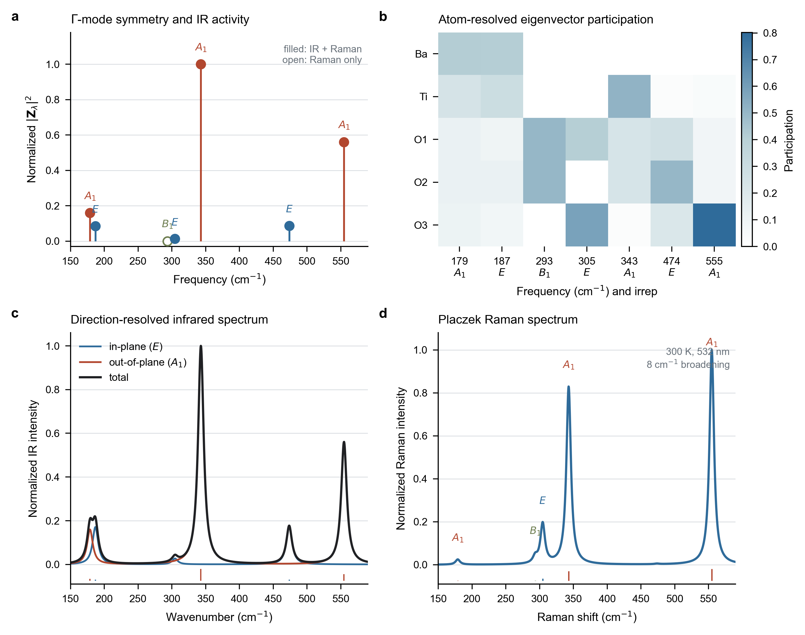
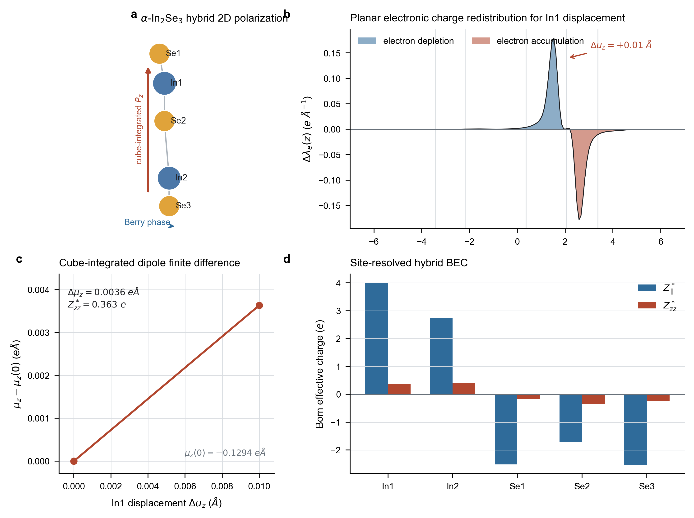

<p align="center">
  
</p>

<h1 align="center">ZStar</h1>

<p align="center">
  面向极化、Born 有效电荷、声子、红外、拉曼与介电响应的可复现工作流工具。
</p>

<p align="center">
  <a href="https://pypi.org/project/zstar/"></a>
  <a href="https://pypi.org/project/zstar/"></a>
  <a href="LICENSE"></a>
</p>

<p align="center">
  <a href="README.md">English</a> | 简体中文 |
  <a href="docs/README.en.pdf">English PDF</a> |
  <a href="docs/README.zh-CN.pdf">中文 PDF</a>
</p>

---

## 项目简介

ZStar 是连接 ABACUS、PyATB 与 Phonopy 的 Python 工作流工具。其核心任务是从原子有限位移和 Berry 相位极化出发，构造满足晶体对称性与声学求和规则的 Born 有效电荷（BEC）张量，并进一步完成声子、红外（IR）、介电、拉曼与分子动力学（MD）介电分析。

ZStar 不会隐藏中间步骤。结构、输入文件、绝缘性门控、极化值、电荷密度、张量重构报告、光谱和任务状态都会保留下来，便于检查、复现与断点续算。

当前版本的数值验证与运行环境汇总见 [docs/validation.zh-CN.md](docs/validation.zh-CN.md)。

### 主要功能

- 前向差分与中心差分 BEC。
- 对称性约化、全原子张量重构和声学求和规则修正。
- `0.no-move -> 位移结构` 的单任务串行、可恢复工作流。
- 所有位移任务复用 `0.no-move` 的收敛电荷密度。
- 参考 SCF 完成后只执行一次绝缘性检查。
- 生成 shell、Slurm 和 Torque/PBS 驱动脚本。
- 自动兼容旧版 PyATB 与支持静态直算的新版本 PyATB。
- 三维与二维混合极化/BEC 处理。
- 声子生成、后处理、模式分类、红外谱、拉曼谱和介电响应。
- 使用固定或逐帧 BEC 的 MD 偶极涨落介电计算。
- 面向薄膜和极性材料的静电势辅助分析。

## 物理处理范围

### 三维周期晶体

对于三维周期晶体，ZStar 根据

```text
Z*(kappa, alpha, beta) = Omega/e * dP_alpha / du_(kappa,beta)
```

计算 BEC。有限差分之前会按照极化量子对 Berry 相位极化分支进行匹配，避免直接相减导致的分支跳变。

### 二维材料

二维薄膜的面内与面外响应采用不同处理：

- **面内分量：**在体系保持绝缘的前提下，沿用 Berry 相位极化差分。
- **面外分量：**从 ABACUS 电荷密度 cube 文件做实空间积分，同时包含离子和电子偶极。
- **归一化：**面内 BEC 通过超胞体积因子消除真空层高度依赖；二维介电谱默认输出与真空无关的片层极化率。

因此，完整二维 BEC 也需要 `x`、`y`、`z` 三个方向的位移。`zstar gen --dim 2` 默认会生成全部三个方向。当前混合算法要求薄膜法向与笛卡尔 `z` 轴对齐；对于倾斜薄膜会明确报错退出。

可以独立审计一对参考/位移电荷密度 cube：

```bash
zstar polar2d --reference-cube reference.cube \
  --displaced-cube atom_zplus.cube \
  --displacement 0.01 --outdir slab_dipole_check
```

程序会输出平面电荷重排、偶极有限差分、有效电荷、诊断信息，以及
PNG/PDF/SVG 图片。

## 安装

ZStar 要求 Python 3.9 或更高版本。

从 PyPI 安装：

```bash
pip install -U zstar
```

从本地仓库安装：

```bash
git clone https://github.com/xdzhu/zstar.git
cd zstar
pip install .
```

外部程序只在对应功能中需要：

- ABACUS：SCF、电荷密度、力与稀疏矩阵。
- PyATB：Berry 相位极化、能带检查和电子介电响应。
- Phonopy：位移结构生成与声子后处理。

检查安装：

```bash
zstar --version
zstar --help
```

## Born 有效电荷工作流

### 1. 生成参考与位移目录

在包含 `STRU` 的目录中执行：

```bash
zstar gen --stru STRU --pyatb --method forward --force
```

二维薄膜：

```bash
zstar gen --stru STRU --dim 2 --pyatb --method forward --force
```

生成的目录从 `0.no-move` 开始，后面是类似 `1.Ti/x+` 的原子/方向位移目录。每个位移目录不再需要单独复制一份任务脚本。

常用选项：

| 选项 | 含义 |
| --- | --- |
| `--method forward|central` | 前向或中心有限差分。 |
| `--reduce` / `--all` | 默认只算对称性代表原子，或强制计算全部原子。 |
| `--move "x y z"` | 显式指定原子位移方向。 |
| `--dim 2|3` | 二维或三维处理。 |
| `--input-mode abacus|pyatb|hamgnn|custom` | 输入文件准备方式。 |
| `--input_sets FILES` | 复制到任务目录的附加文件或文件夹。 |

### 2. 串行执行并支持断点续算

本地 shell 运行：

```bash
zstar workflow run --root . --dim 3 \
  --abacus-command "mpirun -np 1 abacus" \
  --pyatb-command "mpirun -np 1 pyatb" \
  --omp-threads 28
```

二维材料使用 `--dim 2`。

默认执行顺序如下：

1. 执行 `0.no-move` SCF，输出电荷密度与稀疏矩阵。
2. 使用 `pyatb_input --band` 生成常规高对称能带路径。
3. 如果参考结构为金属，在任何位移计算开始前报错退出。
4. 计算参考结构的极化和电子介电张量。
5. 将参考电荷 cube/restart 文件复制到每个位移任务的 `OUT.<suffix>/`。
6. 按确定顺序串行执行全部位移及其极化计算。
7. 在 `.zstar/` 保存阶段状态；中断后再次执行同一命令即可继续。

默认采用普通能带路径进行轻量绝缘性门控。它可以发现所采样路径上的闭隙，但不能排除路径之外的小型费米面。只有显式指定时才采用更严格的 MP 网格：

```bash
zstar workflow run --gap-mode mp --mp-density 0.08
```

查看进度：

```bash
zstar workflow status
```

### 3. 生成不同运行环境的脚本

本地 shell：

```bash
zstar workflow script --backend shell --dim 3
```

Slurm：

```bash
zstar workflow script --backend slurm --dim 3 \
  --queue compute --cpus-per-task 28 --walltime 24:00:00
```

Torque/PBS：

```bash
zstar workflow script --backend torque --dim 3 \
  --queue batch --cpus-per-task 28 --walltime 24:00:00
```

后端默认启动命令会自动适配：shell/Torque 使用 `mpirun -np N`，Slurm
使用 `srun --ntasks=N`。加入 `--dry-run` 可以在不启动计算的情况下检查
脚本、环境、执行顺序和断点状态。三类后端及调度器接收验证见
[docs/validation.zh-CN.md](docs/validation.zh-CN.md#调度后端冒烟检查)。

只有在检查脚本内容并确认运行环境正确后，再使用 `--submit`。

### 4. 后处理极化并构造 BEC

三维：

```bash
zstar deal --dim 3 --method forward --pyatb
```

二维混合处理：

```bash
zstar deal --dim 2 --method forward --pyatb
```

中心差分必须在 `gen` 和 `deal` 两步中都使用 `--method central`。

关键输出：

| 文件 | 含义 |
| --- | --- |
| `Z-BORN-reduced.out` | 显式计算的对称性代表原子的原始张量。 |
| `Z-BORN-symm.out` | 经对称性展开并满足声学求和规则的全原子张量。 |
| `Z-BORN-reduced-neutral.out` | 对称展开与电中性修正后的约化张量。 |
| `BORN` | 电子介电张量和 Phonopy 原子顺序的 BEC。 |
| `BORN-for-phonopy.out` | 与 `BORN` 内容一致、名称更明确的输出。 |
| `born_symmetry_report.json` | 对称重构与残差报告。 |
| `zstar_2d_bec.json` | 二维混合 BEC 的逐原子积分诊断。 |

## 声子与介电响应

### 1. 生成声子位移任务

在包含 `STRU`、`KPT` 以及已设置 `cal_force 1` 的 `INPUT` 的声子目录中执行：

```bash
zstar ph --stru STRU --dim "2 2 2" --symmprec 1e-3
```

随后按照本地运行环境完成全部 `disp-*` 目录中的力计算。`zstar ph` 不要求也不会强制复制 `abacus_x.sh`；若当前目录确有该脚本，则只把它作为可选便利文件复制。

### 2. 后处理力并查看 Gamma 模式分类

```bash
zstar postph
zstar irrep --file irreps.yaml --mode db
```

如果需要非解析项修正，应先把 BEC 工作流中的 `BORN` 复制到声子目录：

```bash
cp ../polar/BORN .
zstar postph --nac
```

### 3. 静态与频率相关介电响应

同时复制完整 BEC：

```bash
cp ../polar/BORN .
cp ../polar/Z-BORN-symm.out .
```

静态介电响应：

```bash
zstar calc --qpoints qpoints.yaml --born Z-BORN-symm.out \
  --dielectric BORN --dim 3
```

频率相关介电响应：

```bash
zstar freq --qpoints qpoints.yaml --born Z-BORN-symm.out \
  --dielectric BORN --dim 3 --plot
```

默认排除低于 5 cm-1 的声学模式；可以通过 `--acoustic-cutoff` 调整。

二维体系不指定 `--thickness` 时，输出与真空层无关、单位为埃的片层极化率：

```bash
zstar calc --qpoints qpoints.yaml --born Z-BORN-symm.out \
  --dielectric BORN --dim 2
```

只有需要定义某个等效三维介电张量时，才设置 `--thickness ANGSTROM`。

## 红外谱

计算模式有效电荷、振子强度、展宽后的红外谱和介电/片层响应：

```bash
zstar ir --qpoints qpoints.yaml \
  --born Z-BORN-symm.out --dielectric BORN \
  --dim 3 --broadening 10 --outdir ir_spectrum
```

也可以显式选择模式：

```bash
zstar ir --modes "4,5,8-10" --outdir ir_selected
```

典型输出包括 `ir_modes.csv`、`ir_spectrum.dat`、`ir_response_real.dat`、`ir_response_imag.dat`、`ir_spectrum.png`、`ir_spectrum.pdf`、`ir_spectrum.svg` 和 `ir_summary.json`。

## 拉曼谱

ZStar 沿 Gamma 点简正坐标对电子介电响应做中心差分，得到非共振 Raman 张量与 Placzek 强度。

### 1. 生成简正模式正负位移

```bash
zstar raman prepare --stru STRU --qpoints qpoints.yaml \
  --modes "4-12" --amplitude 0.02 --outdir raman \
  --copy INPUT-scf --copy KPT
```

`--amplitude` 的单位为 `angstrom * sqrt(amu)`。

### 2. 串行计算、收集并绘谱

```bash
zstar raman run --raman-dir raman \
  --reference 0.no-move --qpoints qpoints.yaml \
  --dim 3 \
  --abacus-command "mpirun -np 1 abacus" \
  --pyatb-command "mpirun -np 1 pyatb" \
  --omp-threads 28
```

参考结构的绝缘性门控只复用一次，不会对每个模式位移重复计算。所有 `plus`/`minus` 阶段都复用参考电荷密度，并记录可恢复状态。

也可以分步执行：

```bash
zstar raman status --raman-dir raman
zstar raman collect --raman-dir raman --qpoints qpoints.yaml --dim 3
zstar raman spectrum --raman-dir raman --qpoints qpoints.yaml --dim 3
```

二维体系使用 `--dim 2`。程序会利用声子数据中的超胞高度，将依赖真空的介电导数转换为片层极化率导数。

## 代表性验证图

紧凑源数据、绘图脚本、矢量图片和完整性清单均归档在
[docs/paper_figures](docs/paper_figures/README.md)。

<p align="center">
  
</p>

BTO 验证包含全部 10 个正频光学模式和 20 个已完成的 Raman 正负有限差分
响应任务，其中 293.38 cm-1 的 `B1` 模式 Raman 活性但 IR 静默。

<p align="center">
  
</p>

In2Se3 验证展示了 Berry 相位/cube 积分的维度分工，以及 In 原子面外位移
引起的真实平面电荷重排。

## MD + BEC 介电响应

`zstar md` 不限定逐帧 BEC 的来源。BEC 可以来自：

- ZStar 对选定 MD 快照做的单帧有限差分计算。
- 对所有帧强制使用同一套固定张量。
- QNEP 或其他外部电荷/BEC 预测模型。

ZStar 负责将张量与轨迹匹配、重建周期性位移、构造离子偶极时间序列，并计算偶极涨落极化率。

固定 BEC：

```bash
zstar md --dump dump.lammpstrj \
  --fixed-bec Z-BORN-symm.out \
  --electronic-dielectric BORN \
  --temperature 300 --type-map "1:Hf,2:Zr,3:O" \
  --outdir md_fixed
```

逐帧 BEC：

```bash
zstar md --dump dump.lammpstrj \
  --bec-dir bec_frames --bec-pattern "frame_{step}.npy" \
  --electronic-dielectric BORN \
  --temperature 300 --type-map "1:Hf,2:Zr,3:O" \
  --start-step 200000 --stride-step 100 \
  --outdir md_dynamic
```

总静态介电张量为

```text
epsilon_total = epsilon_infinity + chi_ionic
```

程序分别写出 `chi_ionic.dat`、`epsilon_ionic.dat`、`epsilon_electronic.dat` 与 `epsilon_total.dat`。如果省略 `--electronic-dielectric`，程序使用单位张量，并明确将结果标识为 `I + chi_ionic`。

## PyATB 新旧版本兼容

ZStar 会探测实际使用的 PyATB 可执行文件：

- 支持静态直算的新版本使用 `static_dielectric_only`。
- 旧版本使用经新版静态截距对照验证的 0-30 eV 紧凑光学区间，步长为 0.1 eV；粗网格避免为静态介电常数计算不必要的高密度完整光谱。
- 同时兼容 `static_dielectric_function.dat` 与旧版 `dielectric_function_real_part.dat`。

探测到的版本和实际选择会记录在 `zstar_pyatb_compat.json`。

## 静电势分析

`zstar potential`（别名 `zstar pot`）可分析 ABACUS 的 `ElecStaticPot.cube`：

```bash
zstar pot --cube OUT.ABACUS/ElecStaticPot.cube \
  --axes z --plane xy --plane-average --tile 5 5 \
  --vacuum-level --vacuum-sides --polar-arrow auto \
  --outdir potential
```

它可以输出轴向平均势、平面周期拼接图、方向平均曲线，以及单侧或双侧真空能级诊断。MoS2、In2Se3、SnS、SnSe 和 SnTe 的渲染示例见 [docs/potential_examples.md](docs/potential_examples.md)。

## 命令总览

| 命令 | 功能 |
| --- | --- |
| `zstar gen` | 生成参考和 BEC 位移目录。 |
| `zstar workflow run/status/script` | 执行、查看或生成串行可恢复工作流。 |
| `zstar deal` / `born` / `polar` | 收集极化并构造 BEC。 |
| `zstar polar2d` | 审计薄膜 cube 对的偶极差与面外 BEC。 |
| `zstar bornsym` / `symcheck` | 按对称性重构或校验张量。 |
| `zstar ph` / `postph` | 生成和后处理声子任务。 |
| `zstar irrep` | 分类 Gamma 点模式的光学活性。 |
| `zstar calc` / `freq` | 计算静态或频率相关介电响应。 |
| `zstar ir` | 计算模式有效电荷与红外谱。 |
| `zstar raman` | 生成、运行、收集并绘制拉曼谱。 |
| `zstar md` | 将 MD 轨迹与固定或逐帧 BEC 结合。 |
| `zstar potential` / `pot` | 分析静电势 cube 文件。 |
| `zstar wyckoff` / `vasp` | 查看 Wyckoff 位置或转换 `STRU`。 |

## 仓库与发布约定

- `examples/` 只保存本地验证数据，已加入忽略列表。
- `dist/` 与 `build/` 是本地构建产物，不提交。
- `job_scripts/` 保存可复用任务模板，随代码提交。
- PyPI 更新流程见 [docs/how_to_update_pypi.md](docs/how_to_update_pypi.md)。

私有 GitHub 仓库中的 README 可以使用相对路径 logo，因为已登录的仓库访问者能够读取图片；PyPI 无法访问私有仓库的图片地址。因此 `README_PYPI.md` 不引用私有相对图片。若希望 PyPI 展示 logo，必须提供长期稳定、无需登录即可访问的 HTTPS 图片地址。

## 引用与许可证

如果 ZStar 支持了您的论文工作，请引用 ZStar 软件论文或对应仓库版本，同时引用实际使用的电子结构与晶格动力学程序。

ZStar 使用 GNU General Public License v3.0。

Copyright (c) Xudong Zhu.
