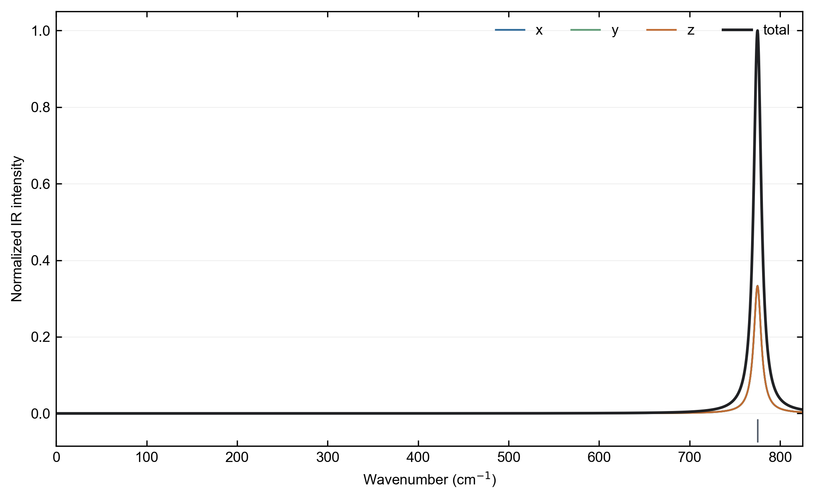
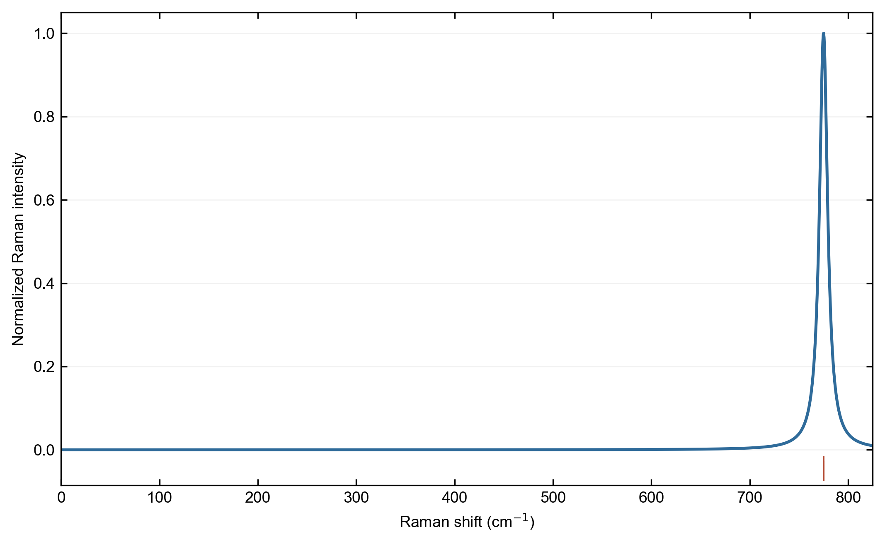
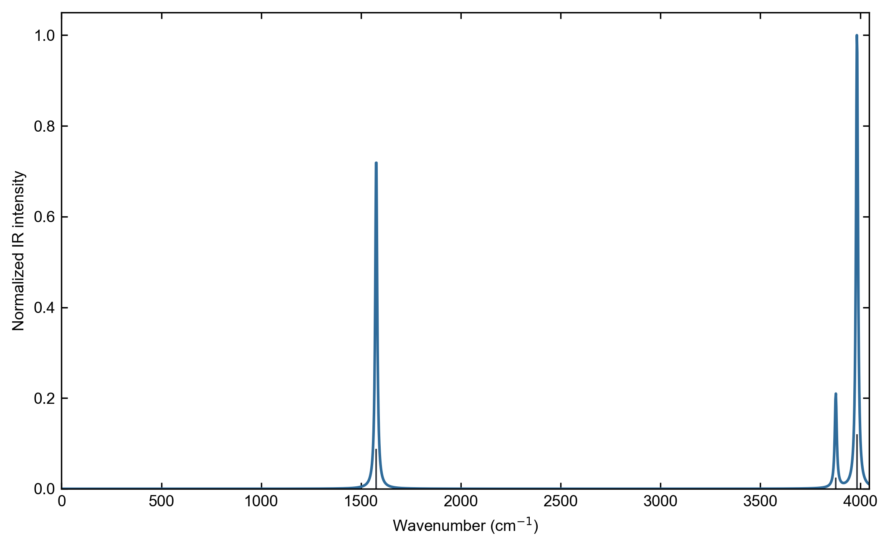
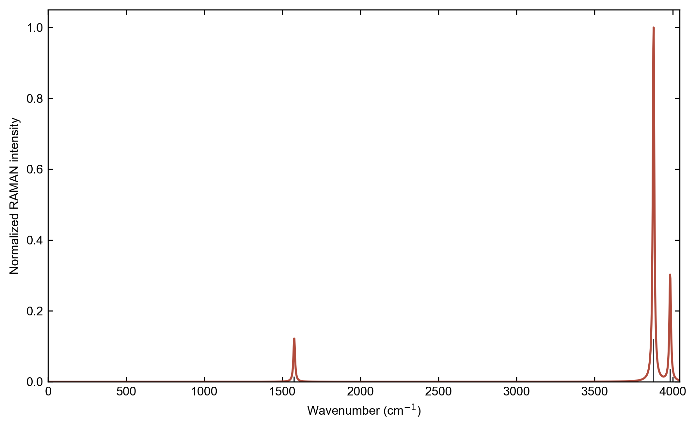

# VASP 与 CP2K 的 IR/Raman 后端

ZStar 将模式分析、谱线展宽、Placzek 因子、表格和绘图保持为计算器无关内核，
电子响应层目前可以选择：

- 原有 `zstar ir`、`zstar raman` 对应的 ABACUS + PYATB；
- 对模式进行中心正负位移后调用 VASP 原生 `LEPSILON` 或 `LCALCEPS`；
- CP2K 原生 `VIBRATIONAL_ANALYSIS INTENSITIES`、偶极和 `LINRES/POLAR`。

VASP 与 CP2K 统一使用新入口 `zstar spectra`。

## VASP：晶体 SiC

首先用 VASP `IBRION=5` 或 `IBRION=6` 得到 Gamma 点频率和本征矢，并保留完整
`vasprun.xml`。然后为所选光学模式生成一个参考响应和中心正负位移：

```bash
zstar spectra prepare --calculator vasp \
  --input-dir vasp_input --modes-xml phonon/vasprun.xml \
  --root vasp_spectra --dim 3 --method dfpt

zstar spectra run --root vasp_spectra \
  --command "mpirun -np 20 vasp_std"

zstar spectra status --root vasp_spectra
zstar spectra collect --root vasp_spectra
```

参考响应提供 IR 所需的 BEC 和冻结离子电子介电张量；Raman 张量则由每个模式
正负位移的介电张量中心差分得到。默认简正坐标步长为
`0.02 Angstrom sqrt(amu)`。任何位移响应开始前，程序都会先检查参考
`vasprun.xml` 的带隙，并拒绝低于 -20 cm-1 的 Gamma 点模式。可用
`--imaginary-tolerance` 修改阈值；只有确实研究不稳定相时才应使用
`--allow-imaginary`。

VASP DFPT 不支持的泛函可使用 `--method finite-field`。此时仍须遵守
[VASP BEC 文档](vasp_bec_zh.md)中的 PEAD 占据、场强和收敛限制。`POTCAR` 只在
本地计算目录间复制，不得提交或再分发。

### VASP SiC 实机验证

端到端测试采用双原子 SiC 晶胞、PBE、520 eV 平面波截断、
15 x 15 x 15 Monkhorst-Pack 网格和 20 个 MPI 进程。参考优先流程先得到
1.3508 eV 带隙，通过绝缘检查后才运行六个位移响应任务。三个光学模式组成
774.964 cm-1 的三重简并模；按 ZStar 相对强度约定，其 IR 总活动度分别为
0.8599、0.8601 和 0.8611，归一化 Raman 活动度分别为 0.6622、0.7989 和
1.0000。参考 BEC 的主方向分量约为 Si +2.691、C -2.691。

Serrano 等对 3C-SiC 报道的 LDA-DFPT 横向光学频率为 793.1 cm-1，同时给出
793(2) cm-1 的 IXS 与 796(1) cm-1 的 Raman 测量。本工作 PBE 结果低 2.29%，
适合作为稳定 Bulk 闭环验证，而不应解释为跨泛函的严格一致
（[doi:10.1063/1.1484241](https://doi.org/10.1063/1.1484241)）。

这个轻量算例验证了模式传递、绝缘门控、串行续算、BEC 解析和介电张量中心
差分；它不等同于晶格、k 网格或位移步长的完整收敛研究。





## CP2K：H2O 分子

从严格收敛的 CP2K 输入开始。ZStar 会把 `RUN_TYPE` 改为
`VIBRATIONAL_ANALYSIS`，同时启用原生 IR/Raman 强度、分子偶极和
`PROPERTIES/LINRES/POLAR`：

```bash
zstar spectra prepare --calculator cp2k \
  --input h2o.inp --root cp2k_spectra --dim 0

zstar spectra run --root cp2k_spectra \
  --command "/path/to/cp2k.ssmp -i input.inp -o output.log" \
  --omp-threads 20 --cp2k-data-dir /path/to/cp2k/data

zstar spectra status --root cp2k_spectra
zstar spectra collect --root cp2k_spectra
```

非交互环境可执行 `zstar spectra script --root WORK --backend
shell|slurm|torque`，生成一个能够续算全部阶段并在成功后汇总两种谱的调度器脚本。

对于分子，生成输入会使用非周期偶极算符、`REFERENCE COM` 和
`CENTER_COORDINATES`。wavelet Poisson 求解要求电子密度在所有非周期盒面衰减，
因此分子居中不是装饰性设置。生成的 `LINRES` 采用 CP2K Raman 回归测试中的
`FULL_SINGLE_INVERSE` 预条件，并拒绝任何非有限响应值。定量比较前必须分别收敛几何结构、基组、截断能、
真空盒、SCF 阈值和有限差分步长。

CP2K 活动度保持原生单位：IR 为 `km/mol`，Raman 为 `Angstrom^4/amu`。ZStar
只对未改动的离散活动度做展宽并绘图。CP2K 同样支持 `--dim 3`，周期晶体保留
完整 Gamma 点模式并使用 Berry 相位偶极算符；收集结果时执行与其他计算器相同
的 -20 cm-1 稳定性门控。

### H2O 实机验证

轻量基准采用 CP2K 2025.2、PBE/DZVP-MOLOPT-SR-GTH、居中的 8 Angstrom
非周期盒、300 Ry 网格截断和 20 个 OpenMP 线程。H2O 的三个分子振动均同时
具有 IR 和 Raman 活性，符合选择定则：

| 模式 | CP2K 谐振频率 (cm-1) | NIST 基频 (cm-1) | IR (km/mol) | Raman (A4/amu) |
| --- | ---: | ---: | ---: | ---: |
| 弯曲 | 1576.08 | 1595 | 70.07 | 5.80 |
| 对称伸缩 | 3877.59 | 3657 | 19.69 | 46.53 |
| 反对称伸缩 | 3983.82 | 3756 | 95.88 | 14.04 |

NIST 给出的对应谐振参考值为 1649、3832 和 3943 cm-1，因此这里的差异符合
未缩放谐振频率与实验基频并不等同的预期。该结果验证工作流与选择定则，不代表
基组和真空盒已经完成定量收敛。参考数据来自
[NIST Chemistry WebBook](https://webbook.nist.gov/cgi/cbook.cgi?ID=C7732185&Mask=801)
和 [NIST CCCBDB](https://cccbdb.nist.gov/exp2x.asp?casno=7732185&charge=0)。





## 输出文件

两个后端都会生成：

| 路径 | 内容 |
| --- | --- |
| `.zstar/spectra_state.json` | 阶段状态、时间、失败原因和续算记录。 |
| `spectra_results.json` | 计算器、频率、活动度/张量及来源。 |
| `ir_spectrum/` | 模式表、展宽数据、PNG/PDF/SVG 和摘要 JSON。 |
| `raman_spectrum/` | 模式表、展宽数据、PNG/PDF/SVG 和摘要 JSON。 |

VASP 结果还包含统一约定的 BEC、介电和 Raman 张量。CP2K 的原生 IR/Raman
活动度不会在数据表中归一化，只有展示曲线缩放到最大值为一。

## 维度边界

原生后端当前接受分子（`--dim 0`）和三维晶体（`--dim 3`），并主动拒绝
`--dim 2`。薄膜的周期面外 BEC/介电响应依赖真空，面外极化必须使用 ZStar 的
实空间 cube 积分；因此二维体系仍应使用已经验证的 ABACUS 混合工作流。

计算器官方文档：[VASP linear response](https://vasp.at/wiki/Linear_response)、
[CP2K vibrational analysis](https://manual.cp2k.org/trunk/CP2K_INPUT/VIBRATIONAL_ANALYSIS.html)、
[CP2K LINRES/POLAR](https://manual.cp2k.org/trunk/CP2K_INPUT/FORCE_EVAL/PROPERTIES/LINRES/POLAR.html)
和 [CP2K coordinate centering](https://manual.cp2k.org/trunk/CP2K_INPUT/FORCE_EVAL/SUBSYS/TOPOLOGY/CENTER_COORDINATES.html)。
