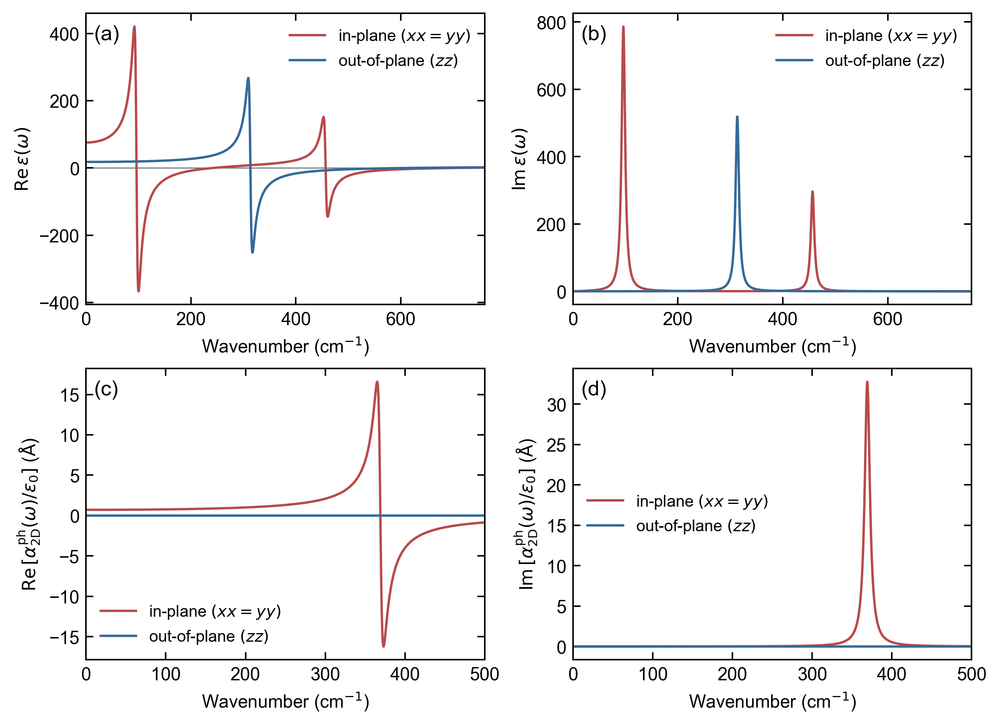

# 静态与频率相关介电响应

[English](dielectric_response.md)

ZStar 将 Born 有效电荷（BEC）张量与 Gamma 点声子本征矢收缩，得到模式
有效电荷、振子张量、静态晶格响应以及复数频率相关响应。输出物理量随体系
维度改变：

| `--dim` | 默认输出 | 单位 |
| ---: | --- | --- |
| 3 | 相对介电张量 | 无量纲 |
| 2 | 片层极化率除以真空介电常数 | Angstrom |
| 1 | 线极化率除以真空介电常数 | Angstrom^2 |
| 0 | Gaussian 分子极化率 alpha/(4 pi epsilon_0) | Angstrom^3 |

对于 `dim=1` 和 `dim=2`，ZStar 不会把依赖真空层大小的超胞介电张量冒充
材料本征介电常数。只有用户明确给出厚度或横截面约定时，程序才换算等效
三维归一化张量，但仍保留源数据的电场约定。若要转换薄层面外本征介电
常数，必须提供相容且包含屏蔽的宏观超胞响应，并通过
`--slab-boundary macroscopic` 选择逆响应转换。详见
[电场定义与 Raman 单位](response_conventions.md)；该选项不会补上 PYATB
源数据中缺失的微观局域场屏蔽。

分子固定取向振动响应应排除整体平移和转动，不能用普通低频截断代替此项
检查。[分子 Unified 基准](../examples/Shared_Response/README.zh-CN.md)
提供独立的质量加权内部子空间核验。

## 所需文件

- `qpoints.yaml`：Gamma 点频率、本征矢、原子质量和晶胞。
- `Z-BORN-symm.out` 或 `BORN`：按 Phonopy 原子顺序排列的 BEC 张量。
- `BORN`：可选的电子介电张量及其后的 BEC 张量。
- `phonopy.yaml`：当 `qpoints.yaml` 不含原胞信息时使用的结构补充文件。

静态命令计算零频极限：

```bash
zstar dielectric static --qpoints qpoints.yaml --born Z-BORN-symm.out \
  --dielectric BORN --dim 3
```

频域命令在相同模式收缩基础上加入阻尼 Lorentz 振子：

```bash
zstar dielectric freq --qpoints qpoints.yaml --born Z-BORN-symm.out \
  --dielectric BORN --dim 3 --broadening 8 \
  --max-frequency 800 --points 2501 --outdir dielectric_response
```

默认自动绘图；只需数据时使用 `--no-plot`。程序默认排除低于 5 cm-1 的
模式，只有在检查 Gamma 点本征体系后才应修改 `--acoustic-cutoff`。

## 三维算例：四方 HfO2

归档的 P42/nmc HfO2 算例采用 ABACUS 3.10 LTS、PBEsol、`TZDP_9au`
目录中的 ONCV 赝势与 TZDP 9-au 数值原子轨道、100 Ry 截断能、10x10x7
电子 k 点和 `1e-8` SCF 阈值。`BORN` 中的电子介电张量为：

```text
epsilon_infinity = diag(5.161604, 5.161604, 4.780272)
```

复现总响应：

```bash
zstar dielectric freq \
  --qpoints docs/paper_figures/source_data/hfo2/qpoints.yaml \
  --born docs/paper_figures/source_data/hfo2/Z-BORN-symm.out \
  --dielectric docs/paper_figures/source_data/hfo2/BORN \
  --dim 3 --broadening 8 --max-frequency 760 --points 2501 \
  --outdir hfo2_dielectric_response
```

所得总静态张量为：

```text
epsilon(0) = diag(75.761034, 75.761034, 18.045191).
```

由于输入中包含电子张量，静态张量与频率曲线都明确标记为**总相对介电
响应**。

## 二维算例：单层 MoS2

归档的 2H-MoS2 算例采用 ABACUS/PBE-D3(BJ)、33x33x1 电子 k 点、
3x3x1 声子超胞和 `1e-8` SCF 阈值：

```bash
zstar dielectric freq \
  --qpoints docs/paper_figures/source_data/mos2/qpoints.yaml \
  --born docs/paper_figures/source_data/mos2/Z-BORN-symm.out \
  --dim 2 --broadening 8 --max-frequency 500 --points 2501 \
  --outdir mos2_dielectric_response
```

归档 BEC 文件不含电子介电张量，因此结果被严格标记为**晶格片层极化率**：

```text
alpha_2D,ph(0) / epsilon_0
    = diag(0.710457, 0.710457, 0.000006) Angstrom.
```

该物理量不依赖任意选择的真空层高度。只有当电子片层响应使用相同结构、
泛函、赝势、基组及归一化重新计算后，才能与晶格项相加。仅在有明确等效
厚度定义时使用 `--thickness`。

## 输出文件

`zstar dielectric freq` 输出：

| 文件 | 内容 |
| --- | --- |
| `static_response.json` | 零频张量、单位、维度及电子背景状态 |
| `ir_modes.csv` | 模式频率、有效电荷和振子强度 |
| `ir_response_real.dat` | 对角响应的实部 |
| `ir_response_imag.dat` | 对角响应的虚部 |
| `dielectric_response.png` | 快速预览图 |
| `dielectric_response.pdf` | 投稿级矢量图 |
| `dielectric_response.svg` | 可编辑矢量图 |
| `ir_summary.json` | 参数、响应类型和输出清单 |

响应数据头会明确区分总响应与仅晶格响应，避免在缺少电子张量时把隐含的
`epsilon_infinity = 1` 误解为真实物理结果。

## 复现论文图片

```bash
python docs/paper_figures/plot_dielectric_response.py
```



脚本只读取仓库内归档数据，并输出 PNG、PDF、可编辑 SVG、600 dpi TIFF、
合并 CSV 以及带哈希的元数据文件。
