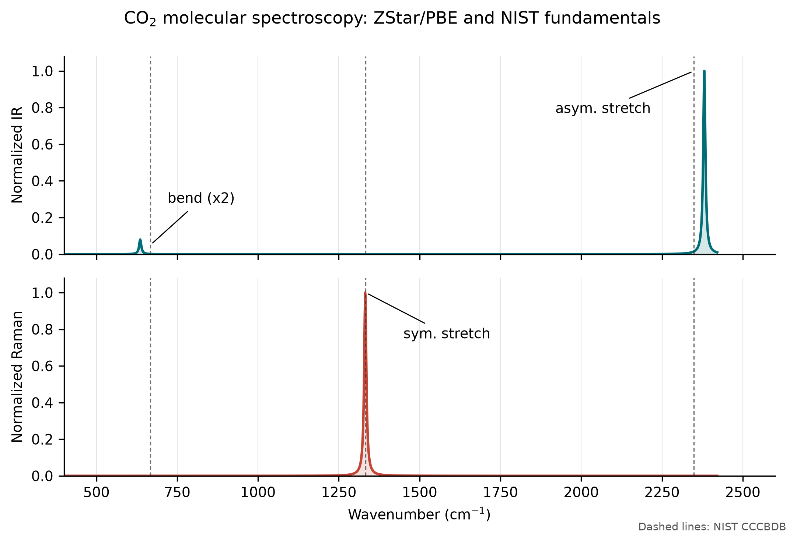

# Paper Figure Archive

This directory contains the source data and Python scripts used for the five
validation figures added to the ZStar CPC manuscript. The archive reproduces
the plotted figures; it does not redistribute the full ABACUS calculation
folders, pseudopotentials, orbitals, or the ignored `examples/` tree.

## Figures

### IR/Raman spectroscopy across dimensionalities


The manuscript uses the twelve-panel `spectroscopy_across_dimensions` figure.
Its completed rows are CH4 (`0D, Molecule`), a hydrogen-passivated GaAs
nanowire (`1D, Nanowire`), 2H-MoS2 (`2D, Slab`), and tetragonal BaTiO3
(`3D, Bulk`). Each row contains a structure rendered directly from its
archived ABACUS `STRU`, followed by calculated IR and Raman spectra. The GaAs,
MoS2, and BaTiO3 IR panels retain directional and total components. Different
panels are normalized independently because molecular, line, sheet, and bulk
response conventions do not share an absolute intensity scale.

The GaAs row contains all 68 positive-frequency IR modes and the disclosed
ten-mode Raman validation subset. The subset covers all four irreducible
representations of the `mm2` point group and required 20 completed
positive/negative electronic-response stages. Its strongest selected Raman
line is the `A1` mode at 143.41 cm-1.

The MoS2 row includes all six optical modes. Its Raman tensors were obtained
from 12 completed central-difference response stages with the PyATB
`static_dielectric_only` kernel. The `E''`, `E'`, and `A1'` families are Raman
active at 270.67, 359.65, and 388.44 cm-1, whereas the `A2''` Raman activity is
only `1.54e-7` of the strongest line. Repeating the representative `E'` and
`A1'` modes with half the normal-coordinate step changed their tensor norms by
only 0.018% and 0.027%, respectively.

### Molecular IR/Raman validation overview


This five-panel figure combines the CH4 and CO2 benchmarks. Panels a and b
quantify agreement with NIST fundamentals and signed frequency errors; panel c
shows the complementary IR/Raman selection rules; panels d and e present the
normalized calculated spectra against NIST reference lines. All seven mode
families lie within 4.70% without empirical frequency scaling.

### Tetragonal BaTiO3 mode spectroscopy


The figure connects Gamma-point irreducible representations, atom-resolved
eigenvector participation, directional IR response, and a full Placzek Raman
spectrum. All ten positive-frequency optical modes were included. The Raman
tensors were obtained from 20 completed positive/negative normal-coordinate
electronic-response calculations. In particular, the 293.38 cm-1 `B1` mode is
Raman active but has zero IR mode charge.

### Alpha-In2Se3 hybrid 2D polarization


The figure shows the dimensional split used for a slab: in-plane BEC rows come
from Berry-phase polarization, whereas the open-direction row comes from the
total dipole of charge-density cubes. A +0.01 Angstrom In(1) displacement gives
`delta p_z = 0.003633148 e Angstrom` and a raw
`Z*_zz = 0.363314836 e`; the site-resolved panel uses the final
symmetry-reconstructed and acoustic-sum-corrected tensors.

### Representative 2D electrostatic-potential diagnostics


The figure contrasts a nonpolar MoS2 slab, whose two local vacuum plateaus
differ by only `-1.65e-5 eV`, with polar alpha-In2Se3, whose opposite-surface
vacuum levels differ by `1.220812 eV`. The revised side-vacuum estimator uses
0.75 Angstrom local windows adjacent to the two surface exclusion boundaries,
so a dipole-correction reset elsewhere in the vacuum is not averaged into a
surface plateau. The lower panels show a plotting-only 3x3 tiling of the SnS
in-plane potential texture, with the central primitive cell outlined by a
dashed box, and a one-period mirror test along `a+b`. The reflection center is
optimized before comparing the profile with its mirrored copy; the normalized
mismatch is `A_M = 0.033`, and the mirror-odd component is shown separately.
This is a microscopic symmetry diagnostic, not a polarization magnitude or a
substitute for a symmetry-restored reference calculation.

### CO2 molecular IR/Raman benchmark



The two panels show the normalized spectra from the production `--dim 0`
workflow and NIST CCCBDB fundamental frequencies. The calculation recovers
the doubly degenerate IR-active bend at 635.64 cm-1, the Raman-only symmetric
stretch at 1331.99 cm-1, and the IR-only asymmetric stretch at 2381.04 cm-1.
`plot_co2_molecular_benchmark.py` rebuilds the PNG, PDF, and SVG from the four
compact CSV/DAT source files.

## Rebuild

From an installed source checkout:

```bash
python -m pip install -e .
python docs/paper_figures/make_validation_figures.py
python docs/paper_figures/plot_co2_molecular_benchmark.py
python docs/paper_figures/plot_molecular_validation_overview.py
python docs/paper_figures/plot_spectroscopy_across_dimensions.py
```

The main script writes PNG (400 dpi), vector PDF, editable SVG, and
LZW-compressed TIFF (600 dpi) files. The CO2 script writes PNG (300 dpi), PDF,
and SVG. `figure_manifest.json` records the plotting backend, reported values,
source-data sizes, and SHA-256 hashes.

## Data Boundaries

- `source_data/bto/` contains the Gamma-point Phonopy data, irreducible
  representations, IR mode table/spectrum, and full Raman table/tensors/spectrum.
- `source_data/in2se3/` contains the Gamma-point Phonopy data, corrected BEC
  tensors, and the derived planar charge-difference profile and dipole summary.
- `source_data/potential/` contains compact slab-normal profiles, local
  two-sided vacuum diagnostics, one SnS planar map, lattice-direction profiles,
  and path-free calculation metadata.
- `source_data/co2/` contains the mode tables and normalized IR/Raman curves
  from the completed PBE molecular benchmark.
- `source_data/molecular/` contains the shared CH4/CO2 benchmark table plus
  the production mode tables and normalized spectra used by the overview.
- `source_data/gaas_nanowire/` contains the public structure provenance,
  Gamma-point modes and irreducible representations, the full eight-decimal
  hybrid BEC tensors, all-mode IR data, the selected-mode Raman data, and a
  hash-based ABACUS/PYATB--VASP comparison record.
- `source_data/hbn/` contains the sanitized reference structure and compact IR
  and Raman outputs from the fresh two-dimensional validation workflow.
- `source_data/mos2/` contains the PBE reference structure, Gamma-point modes
  and irreducible representations, complete IR/Raman tables and spectra,
  direct-static Raman tensors, and path-free calculation metadata.
- Raw ABACUS folders and charge-density cubes remain outside Git because they
  are large calculation artifacts. The compact profile records the values used
  in the figure, including a dipole closure error of
  `6.47e-13 e Angstrom`.
- No source file in this archive contains a private local or cluster path.
