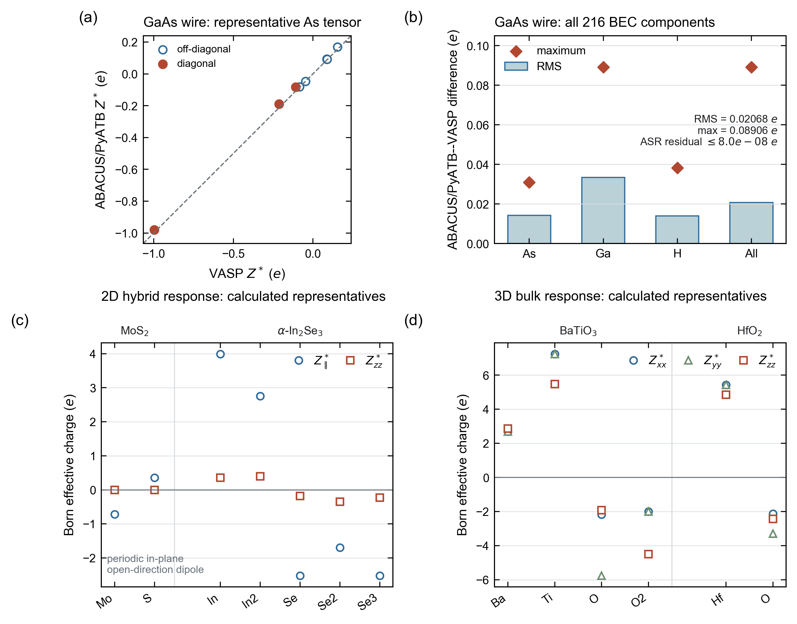

# Paper Figure Archive

This directory contains the source data and Python scripts used for the
validation figures in the ZStar CPC manuscript. The archive reproduces
the plotted figures; it does not redistribute the full ABACUS calculation
folders, pseudopotentials, orbitals, or the ignored `examples/` tree.

## Figures

### BEC and molecular APT literature validation



The six panels follow the manuscript's main validation order: cubic BaTiO3
and tetragonal HfO2 (Bulk), monolayer hBN and alpha-In2Se3 (2D), and isolated
H2O and CH4 (Molecular). Filled circles are ZStar ABACUS+PYATB values; open
symbols are values transcribed from the cited literature. The comparison is
organized by phase, thickness, tensor frame, calculator, and functional rather
than by a cross-code percentage error. The Wu alpha-In2Se3 values are marked as
bilayer thickness context, and the near-zero CH4 GAPT signs are interpreted as
method-sensitive rather than as a strict sign benchmark.

`source_data/bec_literature_benchmark.csv` is the sole numerical input to this
figure. Every literature row includes its DOI, software or numerical method,
exchange-correlation approximation, structure, component, value, and whether
it is a direct comparison or contextual evidence.

### IR/Raman spectroscopy across dimensionalities


The manuscript uses the nine-panel `spectroscopy_across_dimensions` figure.
Its completed rows follow the validation order: tetragonal P42/nmc HfO2
(`3D, Bulk`), 2H-MoS2 (`2D, Slab`), and CH4 (`0D, Molecule`). Each row contains
an author-supplied VESTA view of the retained calculation structure, followed
by calculated IR and Raman spectra. Every spectral panel shows total response
only; IR is red and Raman is blue. Different panels are normalized
independently because molecular, sheet, and bulk response conventions do not
share an absolute intensity scale. The completed GaAs nanowire calculation is
retained as a machine-readable one-dimensional coverage test but is not used
in this main figure.

The light-gray curves are Gaussian-broadened reference envelopes. Unit-weight
published modes are used when a source does not provide comparable intensity
data; they therefore validate frequency rather than absolute intensity. The
HfO2 row retains digitized relative bar heights from the VASP/PBEsol
lattice-dynamics analysis of Fan et al.
([doi:10.1038/s41535-022-00436-8](https://doi.org/10.1038/s41535-022-00436-8)).
All three tetragonal IR and six Raman entries visible in that source figure are
included before broadening.

The refreshed MoS2 row uses ABACUS/PBE-D3(BJ), `scf_thr = 1e-8`, a 33x33x1
primitive-cell k mesh for electronic response, and the retained 3x3x1 phonon
supercell. Its direct-path band gap is 1.819952 eV. Seven symmetry-reduced BEC
stages give `Zxx = Zyy = -0.80585922` and `Zzz = 0.00273336` for Mo, with the
two symmetry-equivalent S atoms carrying the compensating tensor. Contracting
these BECs with all six optical modes makes the E' pair at 369.15 cm-1 the
dominant IR feature. Twelve completed central-difference response stages with
the PyATB `static_dielectric_only` kernel give Raman-active E'', E', and A1'
families at 270.63, 369.15, and 401.50 cm-1, respectively. A1' is the strongest
Raman line, while the A2'' normalized Raman activity is `3.02e-14`, recovering
the expected selection rule to numerical precision.

The HfO2 row uses one PBEsol P42/nmc structure and the ONCV pseudopotentials
and TZDP 9-au numerical atomic orbitals distributed together in the
`ABACUS-orbitals/TZDP_9au` set. Four symmetry-reduced force
displacements give a stable Gamma eigensystem with optical branches from
96.13 to 670.45 cm-1. The complete Raman calculation covers all 15 optical
modes with 30 positive/negative direct-static electronic-response stages.
The gerade A1g, B1g, and Eg branches are Raman active, whereas Eu and A2u are
infrared active and B2u is silent. The strongest Raman line is A1g at
286.16 cm-1; the largest normalized Raman residual among Eu, A2u, and B2u is
`5.86e-9`. The Fan-reference frequency MAEs are 14.62 cm-1 for three IR modes
and 9.46 cm-1 for six Raman modes, providing a centrosymmetric bulk closure without
the soft-mode ambiguity of the archived BTO case.

### Static and frequency-dependent dielectric response


The four-panel `dielectric_response_examples` figure uses the same retained
BEC tensors and Gamma-point modes as the spectroscopy figure. The tetragonal
HfO2 row includes the direct-static electronic background
`diag(5.161604, 5.161604, 4.780272)` and gives the total zero-frequency
permittivity `diag(75.761034, 75.761034, 18.045191)`. The monolayer MoS2 row
is deliberately lattice-only because no electronic sheet tensor is included
in the compact archive; its vacuum-independent static sheet response is
`diag(0.710457, 0.710457, 5.68e-6) Angstrom`.

Both data sets use 8 cm-1 Lorentzian damping. Run

```bash
python docs/paper_figures/plot_dielectric_response.py
```

to regenerate PDF, SVG, PNG, TIFF, the consolidated CSV, figure metadata, and
the corresponding hash records in `figure_manifest.json`.

### Molecular IR/Raman validation overview


This five-panel figure combines the CH4 and CO2 benchmarks. Panels a and b
quantify agreement with NIST fundamentals and signed frequency errors; panel c
shows the complementary IR/Raman selection rules; panels d and e present the
normalized calculated spectra against NIST reference lines. All seven mode
families lie within 4.70% without empirical frequency scaling.

### Tetragonal BaTiO3 mode spectroscopy


The figure connects Gamma-point irreducible representations, atom-resolved
eigenvector participation, directional IR response, and a full Placzek Raman
spectrum. All ten positive-frequency optical modes were included. The Raman
tensors were obtained from 20 completed positive/negative normal-coordinate
electronic-response calculations. In particular, the 293.38 cm-1 `B1` mode is
Raman active but has zero IR mode charge.

This archived figure is now a software and selection-rule diagnostic only.
The same eigensystem contains a doubly degenerate -167.01 cm-1 instability,
which the older positive-frequency plotting path omitted. It is therefore not
used as a physical spectrum benchmark in the manuscript's cross-dimensional
figure; stable tetragonal HfO2 is used for the Bulk row instead.

### Alpha-In2Se3 hybrid 2D polarization


The figure shows the dimensional split used for a slab: in-plane BEC rows come
from Berry-phase polarization, whereas the open-direction row comes from the
total dipole of charge-density cubes. The retained PBEsol calculation uses a
cell-relaxed monolayer. A +0.01 Angstrom In(1) displacement gives
`delta p_z = 0.003494009 e Angstrom` and a raw
`Z*_zz = 0.349400861 e`; the site-resolved panel uses the final
symmetry-reconstructed and acoustic-sum-corrected tensors.

### Representative 2D electrostatic-potential diagnostics


The figure contrasts a nonpolar MoS2 slab, whose two local vacuum plateaus
differ by only `-1.65e-5 eV`, with polar alpha-In2Se3, whose opposite-surface
vacuum levels differ by `1.220812 eV`. The revised side-vacuum estimator uses
0.75 Angstrom local windows adjacent to the two surface exclusion boundaries,
so a dipole-correction reset elsewhere in the vacuum is not averaged into a
surface plateau. The lower panels show a plotting-only 3x3 tiling of the SnS
in-plane potential texture, with the central primitive cell outlined by a
dashed box, and a one-period mirror test along `a+b`. The reflection center is
optimized before comparing the profile with its mirrored copy; the normalized
mismatch is `A_M = 0.033`, and the mirror-odd component is shown separately.
This is a microscopic symmetry diagnostic, not a polarization magnitude or a
substitute for a symmetry-restored reference calculation.

### CO2 molecular IR/Raman benchmark


The two panels show the normalized spectra from the production `--dim 0`
workflow and NIST CCCBDB fundamental frequencies. The calculation recovers
the doubly degenerate IR-active bend at 635.64 cm-1, the Raman-only symmetric
stretch at 1331.99 cm-1, and the IR-only asymmetric stretch at 2381.04 cm-1.
`plot_co2_molecular_benchmark.py` rebuilds the PNG, PDF, and SVG from the four
compact CSV/DAT source files.

## Rebuild

From an installed source checkout:

```bash
python -m pip install -e .
python docs/paper_figures/make_validation_figures.py
python docs/paper_figures/plot_co2_molecular_benchmark.py
python docs/paper_figures/plot_molecular_validation_overview.py
python docs/paper_figures/plot_spectroscopy_across_dimensions.py
```

The main script writes PNG (400 dpi), vector PDF, editable SVG, and
LZW-compressed TIFF (600 dpi) files. The CO2 script writes PNG (300 dpi), PDF,
and SVG. `figure_manifest.json` records the plotting backend, reported values,
source-data sizes, and SHA-256 hashes.

## Data Boundaries

- `source_data/bto/` contains the Gamma-point Phonopy data, irreducible
  representations, IR mode table/spectrum, and full Raman table/tensors/spectrum.
- `source_data/bec_literature_benchmark.csv` contains the plotted ZStar and
  literature BEC/APT values together with DOI and method provenance.
- `source_data/in2se3/` contains the Gamma-point Phonopy data, corrected BEC
  tensors, and the derived planar charge-difference profile and dipole summary.
- `source_data/potential/` contains compact slab-normal profiles, local
  two-sided vacuum diagnostics, one SnS planar map, lattice-direction profiles,
  and path-free calculation metadata.
- `source_data/co2/` contains the mode tables and normalized IR/Raman curves
  from the completed PBE molecular benchmark.
- `source_data/molecular/` contains the shared CH4/CO2 benchmark table plus
  the production mode tables and normalized spectra used by the overview.
- `source_data/gaas_nanowire/` contains the public structure provenance,
  Gamma-point modes and irreducible representations, the full eight-decimal
  hybrid BEC tensors, all-mode IR data, the selected-mode Raman data, and a
  hash-based ABACUS/PYATB--VASP comparison record.
- `source_data/hbn/` contains the sanitized reference structure and compact IR
  and Raman outputs from the fresh two-dimensional validation workflow.
- `source_data/mos2/` contains the PBE reference structure, Gamma-point modes
  and irreducible representations, complete IR/Raman tables and spectra,
  direct-static Raman tensors, and path-free calculation metadata.
- `source_data/hfo2/` contains the exact PBEsol/TZDP 9-au P42/nmc structure,
  full eight-decimal BEC tensors, Gamma-point modes and irreducible
  representations, complete IR/Raman tables and spectra, total complex
  dielectric response, symmetry report, and compact provenance used by the
  Bulk row.
- `source_data/sic/` contains the VASP/PBE 3C-SiC POSCAR, unified result JSON,
  and compact IR/Raman mode tables and spectra retained for calculator-backend
  validation.
- `source_data/pto/` retains the earlier PBEsol P4mm validation closure as an
  archived regression record; it is no longer used by the main Bulk row.
- `source_data/structure_images/` contains the eight author-supplied lossless
  VESTA screenshots embedded in the cross-dimensional and BEC structure figures.
- Raw ABACUS folders and charge-density cubes remain outside Git because they
  are large calculation artifacts. The compact profile records the values used
  in the figure, including a dipole closure error of
  `6.47e-13 e Angstrom`.
- No source file in this archive contains a private local or cluster path.
