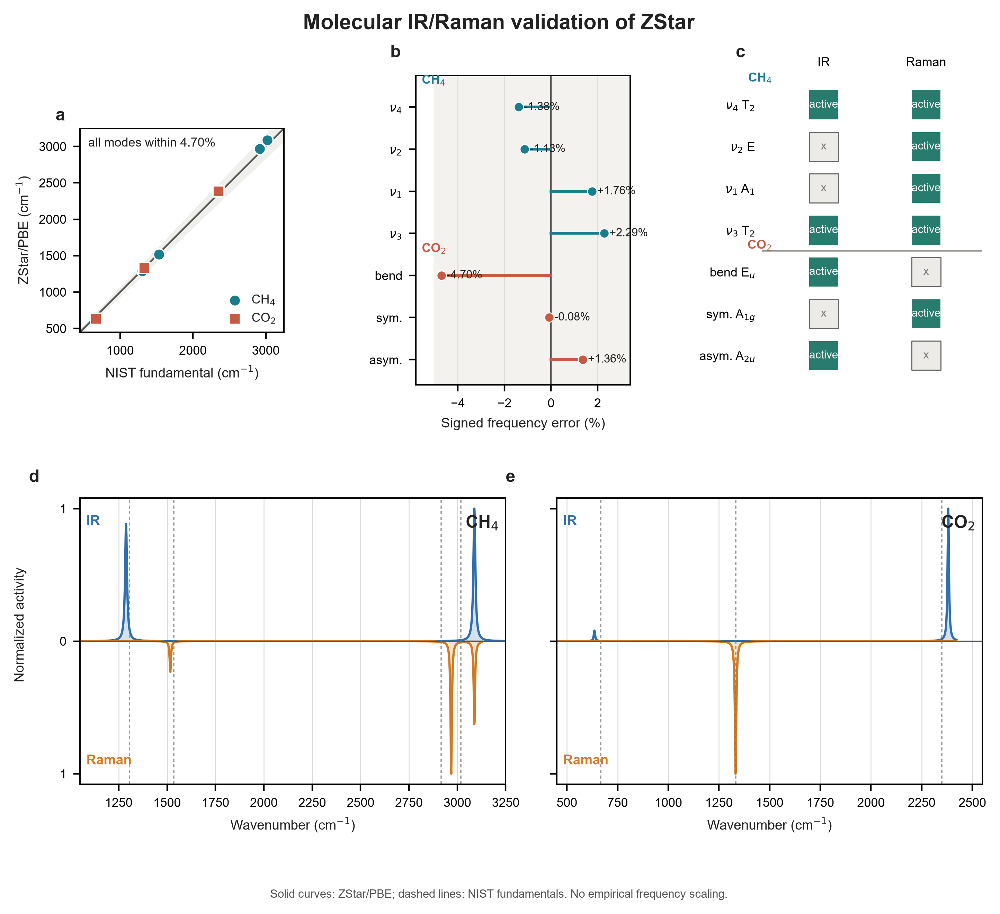

# ZStar 0.2.0 数值验证记录

[English](validation.md)

本文汇总发布级验证结果，不公开本地 `examples/` 目录或远端第一性原理
scratch 目录。表中参数用于软件工作流回归，不代表对每种材料都已完成生产级
收敛性研究。

## 运行环境

- 本地单元与集成测试：Windows 上的 Python 3.10 测试环境。
- 直连计算节点：在专用计算节点上使用 ABACUS 3.10.0-LTS、
  Phonopy 2.38.2 和既有 PyATB 环境。
- PyATB 兼容性：既有接口与 `wheels-cp310plus-2ad34bc.zip` 新版；
  新版被识别为 `1.1.2.dev0+2ad34bc`。
- 调度脚本：在直连计算环境检查 shell 与 Torque/PBS，并在独立 Slurm 集群
  检查 Slurm 脚本和运行环境。

## 测试范围

源码测试覆盖以下功能：

- 参考结构优先的执行顺序、电荷重启文件位置、任务状态和断点续算；
- 默认能带路径门控和显式 Monkhorst-Pack 门控；
- shell、Slurm、Torque 单驱动脚本；
- PyATB 旧版光学接口与新版静态直算接口；
- 三维、二维混合及一维混合 BEC，包括低维张量约定与几何门控；
- 声子目录生成、力的收集与后处理；
- IR 模式有效电荷、一维线响应、二维片层响应、Raman 有限差分与光谱；
- MD 介电计算中的固定 BEC 和逐帧 BEC 输入；
- 存在 dipole correction 势能复位时的薄膜双侧局部真空平台。

当前源码通过全部 130 项测试。被忽略的本地 BTO 算例也成功执行
`zstar deal --dim 3 --method forward --pyatb`，并复现归档的代表性电荷：

| 原子/分量 | BEC (e) |
| --- | ---: |
| Ba | 2.733 |
| Ti | 7.440 |
| 沿 Ti-O 键的 O | -5.861 |
| 垂直 Ti-O 键的 O | -2.157 |

## 调度后端冒烟检查

三个后端均使用单 MPI rank 和 `--dry-run` 实际执行
`zstar workflow script`。检查覆盖脚本生成、环境加载、参考态优先顺序、
状态输出和调度器解析，不会启动 ABACUS 或 PyATB。

| 后端 | 生成脚本 | 默认启动命令 | 环境验证 |
| --- | --- | --- | --- |
| Shell | `run_zstar_born.sh` | `mpirun -np N` | Bash 语法和直接执行通过 |
| Slurm | `run_zstar_born.slurm` | `srun --ntasks=N` | Slurm 22.05 下 Bash/环境 dry run 通过，`sbatch` 接收 |
| Torque/PBS | `run_zstar_born.pbs` | `mpirun -np N` | Torque 6.1.1.1 下 Bash/环境 dry run 通过，`qsub` 接收 |

调度作业被接收后若仍处于排队状态即主动撤销；材料计算仍使用专用直连计算
节点。每个 `.zstar/backend_manifest.json` 都会记录后端、资源、启动命令、
环境脚本、串行执行模型和断点续算状态目录。

## 静电势回归

修正后的 `zstar pot --vacuum-sides` 已使用 MoS2 和 alpha-In2Se3 的原始
`ElecStaticPot.cube` 重新运行。程序从每侧表面排除 6 Angstrom 后，在两个
近表面边界分别取 0.75 Angstrom 局部窗口，并同时报告窗口标准差。

| 体系 | 下侧真空势 (eV) | 上侧真空势 (eV) | 上侧减下侧 (eV) | 最大平台标准差 (eV) |
| --- | ---: | ---: | ---: | ---: |
| MoS2 | 2.96659030 | 2.96657379 | -0.00001651 | 5.15e-6 |
| alpha-In2Se3 | 3.06429908 | 4.28511121 | 1.22081213 | 5.14e-6 |

旧的 In2Se3 数值 `0.361722 eV` 不再采用。它来自对周期真空的整个半区间
求平均，因而把上表面平台与 dipole correction 的势能复位段混在了一起。
局部窗口得到的两个均值都位于可见的平坦区域。SnS、SnSe 和 SnTe 去均值后
`a+b` 与 `a-b` 曲线差的 RMS 分别为 `0.568`、`0.411` 和 `0.188 eV`；
这些量只用于静电势方向诊断，不是极化大小。

## 跨维度全新回归

每种材料均从 `0.no-move` 开始，作为一个确定顺序的串行工作流执行。参考
SCF 完成后，默认用 `pyatb_input --band` 进行普通能带路径门控；只有通过
门控才开始位移计算，并复用参考电荷密度。

| 体系 | 维度 | 路径带隙 (eV) | 位移阶段数 |
| --- | ---: | ---: | ---: |
| MoS2 | 2D | 1.6085 | 6 |
| hBN | 2D | 4.6729 | 6 |
| In2Se3 | 2D | 0.8130 | 15 |
| BaTiO3 | 3D | 1.6822 | 12 |
| PbTiO3 | 3D | 1.6929 | 12 |
| HfO2 | 3D | 4.8051 | 6 |

另一个立方 BTO 种子得到 0.0003 eV 的路径带隙，程序在任何位移阶段开始前
将其拒绝。它只作为负面工作流测试保留，不解释为材料结果。

## 二维混合 Born 有效电荷

张量的行表示原子位移方向，列表示极化方向。面内两列来自 Berry 相位极化
差分，面外一列来自电荷密度 cube 的薄膜总偶极实空间积分。表中数值已经过
声学求和规则修正。

| 体系 | 位点 | Zxx | Zyy | Zzz |
| --- | --- | ---: | ---: | ---: |
| MoS2 | Mo | -0.710 | -0.716 | -0.003 |
|  | S(1) | 0.358 | 0.354 | 0.001 |
|  | S(2) | 0.352 | 0.361 | 0.001 |
| hBN | N | -2.702 | -2.702 | -0.343 |
|  | B | 2.702 | 2.702 | 0.343 |
| In2Se3 | In(1) | 3.991 | 3.988 | 0.361 |
|  | In(2) | 2.751 | 2.752 | 0.397 |
|  | Se(1) | -2.522 | -2.519 | -0.178 |
|  | Se(2) | -1.696 | -1.697 | -0.348 |
|  | Se(3) | -2.525 | -2.522 | -0.230 |

这些二维测试中的最大逐原子声学求和修正小于 0.005 e。

## 全新三维 Born 有效电荷

三维体系的对称约化计算得到下列修正后代表张量。其余对称等价氧原子通过
笛卡尔轴的正确交换生成。

| 体系 | 代表位点 | Zxx | Zyy | Zzz |
| --- | --- | ---: | ---: | ---: |
| BaTiO3 | Ba | 2.700 | 2.700 | 2.861 |
|  | Ti | 7.239 | 7.239 | 5.478 |
|  | O(1) | -2.170 | -5.769 | -1.919 |
|  | O(2) | -2.002 | -2.002 | -4.502 |
| PbTiO3 | Pb | 3.695 | 3.695 | 3.408 |
|  | Ti | 6.102 | 6.102 | 5.125 |
|  | O(1) | -5.094 | -2.628 | -2.118 |
|  | O(2) | -2.076 | -2.076 | -4.299 |
| HfO2 | Hf | 5.426 | 5.426 | 4.861 |
|  | O | -2.130 | -3.296 | -2.431 |

使用经过验证的 0-30 eV 旧版 PyATB 区间，对应的电子介电张量对角元为：
BaTiO3 `(6.465, 6.465, 5.921)`、PbTiO3 `(7.380, 7.380, 7.215)`、
HfO2 `(4.855, 4.855, 4.477)`。

## PyATB 静态响应兼容性

使用同一套 hBN 稀疏矩阵分别验证两个接口：

| 接口 | 电子介电张量对角元 |
| --- | --- |
| 旧版紧凑光谱，0-30 eV、步长 0.1 eV | (1.404743, 1.404743, 1.142735) |
| 新版静态直算 | (1.408043, 1.408043, 1.147124) |

最大分量绝对差为 0.0044。旧版使用 0-0.1 eV 窗口会给出错误的单位张量，
因此不再采用。自 ZStar 0.1.1 起，无法使用静态直算时默认使用经过验证的
0-30 eV 紧凑区间。

## 一维 GaAs 纳米线

正式的一维路线使用由 Materials Cloud 记录 2023.148 重建的 24 原子氢钝化
GaAs 纳米线进行验证。ABACUS/PYATB 参考态的默认路径带隙为 3.3994 eV。
中心差分 BEC 流程完成了 49 个参考/位移阶段，并将周期 `z` 方向的 Berry 响应
与横向 `x/y` 高精度电荷密度偶极结合。按笛卡尔坐标自动匹配独立 VASP
`LEPSILON` 结果后，24 个原子的 BEC 分量 RMS 差为 0.02068 e，最大差为
0.08906 e。代表性 As 原子 1 映射到 VASP 原子 3，九个分量的差均不超过
0.02508 e。

周期方向电子线极化率在 ABACUS/PYATB 与 VASP 中分别为 27.099 和
27.218 Angstrom^2，相对差为 0.436%。横向分量不作为同口径验证：VASP
`LEPSILON` 包含 DFT 局域场效应，而 PYATB Kubo 响应属于独立粒子近似；该差异
保留在机器可读比较记录中，没有被隐藏或误写成一致。

1 x 1 x 2 Phonopy 超胞共完成 40 个 ABACUS 力计算，得到 72 个 Gamma 模式。
-10.00 至 -1.70 cm-1 的四条近零分支对应自由纳米线的一条纵向、一条扭转和
两条弯曲声学分支。对于 800 cm-1 以下的 56 个稳定晶格模，与归档 Quantum
ESPRESSO 参考相比，MAE 为 7.6878 cm-1，RMSE 为 8.8459 cm-1。由此在 BEC
收缩和绘谱之前，先验证了一维力、模式顺序和对称性处理链。

## 红外与拉曼检查

全新的 In2Se3 Gamma 点力计算链生成了 20 个位移力任务以及 `FORCE_SETS`、
`phonopy.yaml` 和 `qpoints.yaml`。将声子模式与二维混合 BEC 结合后，片层
响应中得到 12 个光学模式。最强的测试模式对位于 156.06 和
156.24 cm-1，面内模式有效电荷的模分别为 0.4951 和 0.4946。以面外响应
为主的 254.65 cm-1 模式给出 `Zmode_z = -0.0598`。

同一条 IR 命令在七个验证体系上均完整执行：

| 体系 | 输出光学模式数 | 最强模式 (cm-1) | 模式有效电荷模 |
| --- | ---: | ---: | ---: |
| GaAs 纳米线 | 68 | 502.50 | 1.6890 |
| MoS2 | 6 | 359.65 | 0.1153 |
| hBN | 3 | 1371.42 | 1.0937 |
| In2Se3 | 12 | 156.06 | 0.4951 |
| BaTiO3 | 10 | 342.94 | 1.1848 |
| PbTiO3 | 12 | 208.74 | 1.4485 |
| HfO2 | 15 | 322.57 | 1.3199 |

二维体系输出片层极化率，三维体系输出相对介电张量，不能把两种归一化下的
强度当作同一种体响应直接比较。

一维、二维和三维周期体系的 Raman 均完成正负位移电子结构计算、中心差分、
张量收集和绘谱。GaAs 选定模式用于检查一维线极化率导数，hBN 选定模式和
MoS2 的完整光学模式集合用于检查二维片层约定；四方 BTO 则扩展到全部 10 个
正频光学模式：

| 体系 | 响应约定 | 模式 (cm-1) | 代表性结果 |
| --- | --- | ---: | --- |
| GaAs 纳米线 | 一维线极化率导数 | 143.41 A1 | diag(R) = (0.4352, 0.4302, 0.5185)，归一化活性 = 1.0000 |
| hBN | 二维片层极化率导数 | 1371.42 | Rxx = 13.865，Ryy = -13.858，退偏比 = 0.7500 |
| MoS2 | 二维片层极化率导数 | 388.44 A1' | diag(R) = (-1.7774, -1.7774, -8.8043)，退偏比 = 0.1541 |
| BaTiO3 | 三维介电张量导数 | 554.70 | diag(R) = (0.8465, 0.8465, 1.0978)，退偏比 = 0.00484 |

MoS2 使用 PyATB `1.1.2.dev0+2ad34bc` 的直接 `static_dielectric_only` Kubo
内核，对 4-9 号模式完成 12 个正负位移阶段。270.67 cm-1 的二重简并 `E''`、
359.65 cm-1 的二重简并 `E'` 和 388.44 cm-1 的 `A1'` 归一化 Raman 活性
分别为 0.1897、0.4730 和 1.0000；439.78 cm-1 的 IR 活性 `A2''` 模式残余
Raman 活性仅为 `1.54e-7`，恢复了 D3h 选择定则。把简正坐标步长从
0.02 降至 0.01 Angstrom sqrt(amu) 后，`E'` 和 `A1'` 张量范数仅变化
0.018% 和 0.027%。

BTO 的模式分类还给出了独立的选择定则检查：293.38 cm-1 的 `B1` 模式
IR 模式有效电荷严格为零，但归一化 Raman 活性为 0.0299；342.94 cm-1 的
`A1` 模式具有最大的模式有效电荷模 1.1848；554.70 cm-1 的 `A1` 模式是
计算所得最强 Raman 峰。这些结果共同验证了数据传递、简并处理、归一化、
中心差分、张量收集和光谱输出，不代表已经对实验绝对强度或峰位完成生产级
收敛。

论文级图片、绘图脚本、紧凑源数据和哈希已归档于
[docs/paper_figures](paper_figures/README.md)：

- [四方 BTO 模式、IR 与 Raman 图](paper_figures/bto_mode_spectroscopy.png)
- [alpha-In2Se3 二维混合极化/BEC 图](paper_figures/in2se3_hybrid_polarization.png)
- [已验证的 Molecule--Nanowire--Slab--Bulk IR/Raman 对比图](paper_figures/spectroscopy_across_dimensions.png)

## 分子光谱

正式的 `--dim 0` 路径使用 20 Angstrom 真空超胞中的甲烷完成验证。计算采用
ABACUS 3.10.0 LTS、PBE、100 Ry 截断能和简正坐标中心差分，未使用经验频率缩放。

| 基频 | 对称性 | ZStar/ABACUS (cm-1) | NIST (cm-1) | 误差 | IR | Raman |
| --- | --- | ---: | ---: | ---: | --- | --- |
| nu4 弯曲 | T2 | 1287.93 | 1306 | -1.38% | 活性 | 活性 |
| nu2 弯曲 | E | 1516.62 | 1534 | -1.13% | 禁戒 | 活性 |
| nu1 对称伸缩 | A1 | 2968.29 | 2917 | +1.76% | 禁戒 | 活性 |
| nu3 非对称伸缩 | T2 | 3088.05 | 3019 | +2.29% | 活性 | 活性 |

计算恢复了 `A1 + E + 2 T2` 的简并度和全部 IR/Raman 选择定则。新 CLI 生成的
IR 与 Raman CSV 和独立审计过的 CH4 换算脚本逐点一致。实验频率和归属来自
[NIST Chemistry WebBook](https://webbook.nist.gov/cgi/cbook.cgi?ID=C74828&Mask=887)。

互补的 CO2 全流程已在专用计算节点上用 1 个 MPI 进程和 20 个 OpenMP 线程直接完成。
接受的 PBE 结构键长为 1.17042 Angstrom，最大残余力为 0.00623 eV/Angstrom；
路径采样的参考带隙为 8.6179 eV。

| 基频 | 对称性 | ZStar/ABACUS (cm-1) | NIST (cm-1) | 误差 | IR | Raman |
| --- | --- | ---: | ---: | ---: | --- | --- |
| 二重简并弯曲 | Eu | 635.64 | 667 | -4.70% | 活性 | 禁戒 |
| 对称伸缩 | A1g | 1331.99 | 1333 | -0.08% | 禁戒 | 活性 |
| 非对称伸缩 | A2u | 2381.04 | 2349 | +1.36% | 活性 | 禁戒 |

禁戒 Raman 相对强度低于 `2.5e-15`，禁戒 IR 活性在输出精度内为零，因此计算同时
通过中心对称互斥定则和频率检查。紧凑源数据与可复现图片已归档于
[docs/paper_figures](paper_figures/README.md)。

## CP2K BEC 后端

CP2K 后端在专用计算节点上使用官方 CP2K 2025.2 静态可执行文件直接验证，其 SHA256
为 `f80da1a05fd424a073bf20ed013a277e6af603659dc2c3ff4840b156f0293e8e`。
首先原样执行 CP2K 自带的 `h2o_apt_fdiff.inp`，得到 checksum `0.0034319918`，
与官方回归参考值完全一致。

随后采用更严格的六原子周期 H2O 输入，对比 ZStar 的“位移-偶极导数”和 CP2K
原生“有限电场-力导数”。两条路线使用相同的 LDA/SZV-GTH 模型、400 Ry 等效
GPW 截断、`EPS_SCF=1e-9`、0.005 Angstrom 原子位移和 `1e-4` a.u. 电场步长。
ZStar 串行完成一个参考任务和 36 个位移任务，并在全部位移中复用参考波函数。

| H2O 对照指标 | 结果 |
| --- | ---: |
| 对比张量分量数 | 54 |
| 最大绝对差 | 0.000837 e |
| 均方根差 | 0.000179 e |
| ZStar 声学和最大分量 | 0.002852 e |
| CP2K 原生声学和最大分量 | 0.002857 e |

CP2K 原始 APT 文件以电场方向为行、力方向为列；ZStar 的统一约定则以位移/力
方向为行、极化/电场方向为列。比较器会先转置原始矩阵。如果遗漏这一步，H2O
非对角元会出现约 0.10 e 的伪差异。

岩盐 MgO 用作周期固体补充诊断。计算采用 PBE、TZVP 基组、500 Ry 等效截断、
`EPS_SCF=1e-8` 和 0.005 Angstrom 位移。ZStar 的代表原子张量在输出精度内满足
立方对称性：

| 原子 | ZStar 对角 BEC (e) | CP2K 原生对角 BEC (e) |
| --- | ---: | ---: |
| Mg | +1.90239 | +1.89558 |
| O | -1.90315 | -1.80470 |

ZStar 所选 Mg+O 的对角求和仅为 `0.000763 e`；CP2K 原生完整八原子 APT 的声学
和最大分量却为 `0.36351 e`。其中 O 的差异达到 `0.09845 e`，而 Mg 只差
`0.00681 e`。把原生电场步长从 `1e-4` 扫描到 `1e-3` a.u. 也没有消除该残差。
因此，这个 MgO 结果被保留为当前输入与 CP2K 2025.2 原生 APT 的不一致诊断，
而不作为验收参考。它也说明为什么 ZStar 必须输出求和规则诊断，不能盲目接受
后端内部张量。

完整实现与命令见 [CP2K BEC 中文文档](cp2k_bec.zh-CN.md)。CP2K 官方资料包括
[发行版安装说明](https://manual.cp2k.org/trunk/getting-started/distributions.html)、
[周期电场输入](https://manual.cp2k.org/trunk/CP2K_INPUT/FORCE_EVAL/DFT/PERIODIC_EFIELD.html)
以及首次加入有限差分 APT 的
[CP2K 2025.2 发布说明](https://github.com/cp2k/cp2k/releases/tag/v2025.2)。

## Quantum ESPRESSO 后端

计算器无关 DFPT 路线使用集群现有 Quantum ESPRESSO 6.2.1 模块，在两个专用
计算节点上完成实机验证。孤立 CO2 输入闭环执行了
`pw.x -> ph.x -> dynmat.x`，并输出统一规范的介电、BEC、模式频率和 IR 活性
记录。由于该输入没有预先弛豫，只作为接口测试，不用于频率 benchmark。

闪锌矿 SiC bulk 使用 PBE、`6 x 6 x 6` k 网格和 20 个 MPI 进程，三个可恢复
阶段均正常完成：

| SiC QE 闭环 | 解析结果 |
| --- | ---: |
| 参考态 HO-LU 带隙 | 1.3553 eV |
| 电子介电张量 | 7.5667 I |
| 光学模频率 | 785.39 cm-1（三重简并） |
| IR 活性 | 每个光学模 20.7189 |
| Si / C 原始对角 BEC | +2.6570 / -2.8403 e |

`0.1833 e` 的声学和残差被原样保留并报告。这组低成本设置验证旧版 QE 重启
兼容、绝缘性门控、阶段恢复、解析方向、统一 schema 导出和光谱生成，不作为
收敛的 SiC 响应 benchmark。完整命令见
[计算器无关中文手册](calculator_independent_backends.zh-CN.md)。

## 复现边界

原始材料目录仅保存在被忽略的 `examples/` 或隔离的远端 scratch 空间，
明确排除在 Git、源码包和 wheel 之外。任何用于论文的结果，都应将对应的
机器可读阶段记录、张量与光谱随科研数据一同归档。
